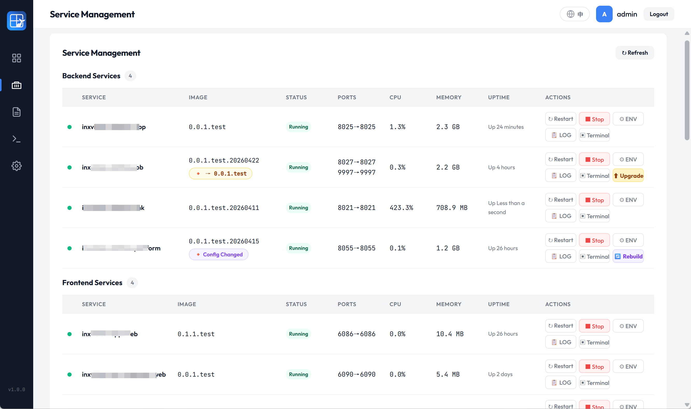
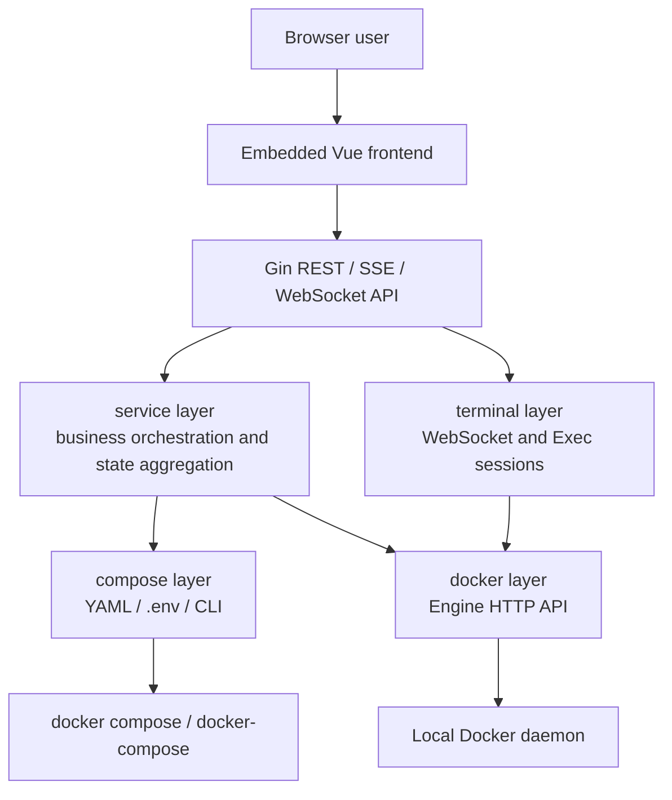

<p align="center">
  
</p>

# ComposeBoard

> A lightweight visual management panel for single-node Docker Compose projects, covering daily operations, upgrades, environment editing, logs, and browser-based container terminals.

[中文](ReadMe.md) | [Product Manual](docs/PRODUCT_MANUAL.md) | [Technical Overview](docs/TECHNICAL_OVERVIEW.md) | [Build, Deploy and Usage](docs/BUILD_DEPLOY_USAGE.md)

Author: LingFeng（凌封）
Homepage: https://fengin.cn  
AI Book: https://aibook.ren  
GitHub: https://github.com/fengin/compose-board

## Positioning

ComposeBoard is not a Kubernetes platform or a full server control panel. It focuses on a smaller and very common use case:

You already have a stable `docker-compose.yml` or `compose.yaml` project, and you want a single-binary, low-resource, offline-capable web panel for service status, lifecycle actions, upgrades, logs, `.env` editing, and container terminal access.


## Highlights

| Highlight                 | Description                                                                                                          |
| ------------------------- | -------------------------------------------------------------------------------------------------------------------- |
| Single binary             | Go binary with embedded frontend assets. No database, Node.js runtime, or external CDN required                      |
| Compose-first view        | Uses the Compose declaration as the primary view, so undeployed services are still visible                           |
| Native Docker labels      | Identifies containers through `com.docker.compose.project` and `com.docker.compose.service` instead of name guessing |
| Profile operations        | Detects Compose Profiles and supports group enable/disable workflows                                                 |
| Upgrade and rebuild hints | Detects image differences for `image:` services and `.env` changes for rebuild decisions                             |
| Real-time logs            | Supports historical logs and SSE live streams, with container replacement tracking                                   |
| Web terminal              | Connects to running containers through Docker Exec, WebSocket, and xterm.js                                          |
| Low footprint             | Around 20 MB RSS while idle and around 30 MB RSS during active use in local tests                                    |
| Offline-first             | Vue, Vue Router, xterm.js, fonts, and icons are bundled locally                                                      |
| Bilingual UI              | Chinese and English locale files are maintained with symmetric keys                                                  |

## Feature Overview

| Module         | Capabilities                                                                               |
| -------------- | ------------------------------------------------------------------------------------------ |
| Authentication | Config-file username/password, JWT auth, query token support for WebSocket                 |
| Dashboard      | Project, Compose command, host, Docker, CPU, memory, disk, and service status summary      |
| Services       | Service list, categories, status, ports, resources, start, stop, restart, upgrade, rebuild |
| Profiles       | Optional services grouped by profile, with profile-level enable and disable                |
| Environment    | `.env` table mode and raw text mode, diff confirmation, automatic backup                   |
| Logs           | Service selection, history logs, live logs, auto scroll, reconnect state                   |
| Web terminal   | Open an interactive shell in a running service container                                   |
| About          | Version, author homepage, AI Book, and GitHub information                                  |



## Architecture



Main stack:

| Layer              | Technology                                                                       |
| ------------------ | -------------------------------------------------------------------------------- |
| Backend            | Go 1.25, Gin, JWT, gopsutil                                                      |
| Docker access      | Direct Docker Engine HTTP API. Unix Socket on Linux/macOS, Named Pipe on Windows |
| Compose operations | Auto-detects `docker compose` or `docker-compose` CLI                            |
| Frontend           | Vue 3, Vue Router, plain CSS, lightweight i18n                                   |
| Logs               | Docker logs API + SSE                                                            |
| Web terminal       | Docker Exec API + WebSocket + xterm.js                                           |
| Static assets      | Embedded with `go:embed` for offline usage                                       |

See [Technical Overview](docs/TECHNICAL_OVERVIEW.md) for details.

## Quick Start

1. Prepare an existing Docker Compose project, for example `/opt/my-compose-project`.
2. Copy the config template:

```powershell
Copy-Item config.yaml.template config.yaml
```

3. Edit `config.yaml`:

```yaml
server:
  host: "0.0.0.0"
  port: 9090

project:
  dir: "/opt/my-compose-project"
  name: "My Compose Project"

auth:
  username: "admin"
  password: "changeme"
  jwt_secret: "please-change-this-secret"

compose:
  command: "auto"
```

4. Start ComposeBoard:

```powershell
.\composeboard-windows-amd64.exe -config .\config.yaml
```

Linux example:

```bash
chmod +x ./composeboard-linux-amd64
./composeboard-linux-amd64 -config ./config.yaml
```

5. Open:

```text
http://SERVER_IP:9090
```

See [Build, Deploy and Usage](docs/BUILD_DEPLOY_USAGE.md) for the full guide.

## Compose Project Adaptation

ComposeBoard can read a Compose project without modifying it. For better UI grouping, add an optional label:

```yaml
services:
  api:
    image: example/api:${APP_VERSION}
    labels:
      com.composeboard.category: backend
```

Supported category values:

| Value      | Meaning                 |
| ---------- | ----------------------- |
| `base`     | Base services           |
| `backend`  | Backend services        |
| `frontend` | Frontend services       |
| `init`     | Initialization services |
| `other`    | Other services          |

Use Compose Profiles for optional service groups:

```yaml
services:
  worker:
    image: example/worker:latest
    profiles:
      - worker
```

## Current Scope

ComposeBoard currently focuses on single-node, single-project, single-replica Compose operations:

| Supported                                           | Not covered yet                                                 |
| --------------------------------------------------- | --------------------------------------------------------------- |
| Local Docker daemon                                 | Remote Docker Host or SSH Docker                                |
| One Compose project per instance                    | Multi-project management                                        |
| One service to one container view                   | Compose scale or replicas management                            |
| Upgrade and rebuild for `image:` services           | Direct build and start for undeployed `build:` services         |
| Lifecycle, logs, and terminal for deployed services | Kubernetes, Swarm, or cluster orchestration                     |
| Online `.env` editing                               | Registry credential management, still handled by `docker login` |

## Documentation

| Document                                               | Audience                                             |
| ------------------------------------------------------ | ---------------------------------------------------- |
| [Product Manual](docs/PRODUCT_MANUAL.md)               | Users, operators, product evaluators                 |
| [Technical Overview](docs/TECHNICAL_OVERVIEW.md)       | Backend, frontend, and architecture maintainers      |
| [Technical Parameters](docs/TECHNICAL_PARAMETERS.md)   | Deployment owners, operators, security reviewers     |
| [Build, Deploy and Usage](docs/BUILD_DEPLOY_USAGE.md)  | Developers, deployment owners, end users             |
| [Development Standards](docs/DEVELOPMENT_STANDARDS.md) | Maintainers and contributors                         |
| [Short Introduction](docs/INTRODUCTION.md)             | Quick presentation and product selection             |
| [Development Archives](docs/dev/)                      | Design, decision, review, and implementation records |

## License

[Apache License, Version 2.0](LICENSE)
