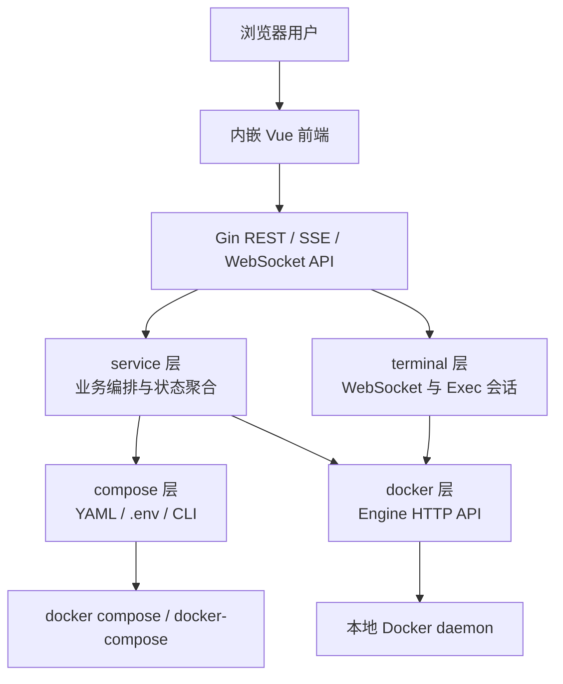

<p align="center">
  
</p>

# ComposeBoard

> 轻量级 Docker Compose 可视化管理面板，面向单机 Compose 项目的日常运维、版本升级、环境配置、日志排查和 Web 终端操作。

[English](ReadMe.en.md) | [产品功能说明](docs/PRODUCT_MANUAL.md) | [技术说明](docs/TECHNICAL_OVERVIEW.md) | [编译部署使用](docs/BUILD_DEPLOY_USAGE.md)

作者：凌封  
作者主页：https://fengin.cn  
AI 全书：https://aibook.ren  
GitHub：https://github.com/fengin/compose-board

## 产品定位

ComposeBoard 不是 Kubernetes 平台，也不是全功能服务器面板。它专注解决一个更常见、更轻量的场景：

已经有一个稳定的 `docker-compose.yml` / `compose.yaml` 项目，团队希望用一个单文件、低资源、可离线运行的 Web 面板完成服务查看、启停、升级、日志、`.env` 配置和容器终端操作。


## 核心特点

| 特点             | 说明                                                                           |
| -------------- | ---------------------------------------------------------------------------- |
| 单文件部署          | Go 二进制内嵌前端资源，无数据库、无 Node.js 运行时、无外部 CDN                                      |
| Compose 声明态视图  | 以 Compose 文件声明为主视图，未部署服务也能展示                                                 |
| 原生 Docker 标签识别 | 使用 `com.docker.compose.project` / `com.docker.compose.service` 定位容器，不依赖服务名猜测 |
| Profile 分组运维   | 识别 Compose Profiles，支持整组启用、停用和状态展示                                           |
| 镜像升级与配置重建      | 对 `image:` 服务检测镜像差异，对 `.env` 变更提示相关服务重建                                      |
| 实时日志           | 支持历史日志与 SSE 实时日志流，服务重建后可继续跟随新容器                                              |
| Web 终端         | 基于 Docker Exec + WebSocket + xterm.js 直连运行中容器                                |
| 低资源占用          | 实测休眠约 20 MB RSS，活跃约 30 MB RSS，适合低配服务器和边缘节点                                   |
| 离线优先           | Vue、Vue Router、xterm.js、字体等前端依赖均随程序内置                                        |
| 中英双语           | 前端 locale 保持中英文 key 对称，支持运行时切换                                               |

## 功能概览

| 模块       | 能力                                       |
| -------- | ---------------------------------------- |
| 登录认证     | 配置文件账号密码，JWT 认证，WebSocket 支持 query token |
| 系统概览     | 项目、Compose 命令、主机、Docker、CPU、内存、磁盘、服务状态统计 |
| 服务管理     | 服务列表、分类、状态、端口、资源占用、启动、停止、重启、升级、重建        |
| Profiles | 可选服务按 profile 分组，支持启用和停用整组服务             |
| 环境配置     | `.env` 表格模式和文本模式编辑，保存前差异确认，自动备份          |
| 日志查看     | 服务选择、历史日志、实时日志、自动滚动、重连状态提示               |
| Web 终端   | 选择运行中服务，浏览器内打开交互式 shell                  |
| 关于信息     | 产品版本、作者主页、AI 全书、GitHub 信息                |


## 技术架构



主要技术栈：

| 层级         | 技术                                                                           |
| ---------- | ---------------------------------------------------------------------------- |
| 后端         | Go 1.25、Gin、JWT、gopsutil                                                     |
| Docker 通信  | 直接调用 Docker Engine HTTP API，Linux/macOS 使用 Unix Socket，Windows 使用 Named Pipe |
| Compose 操作 | 自动检测 `docker compose` 或 `docker-compose` CLI                                 |
| 前端         | Vue 3、Vue Router、原生 CSS、轻量 i18n                                              |
| 日志         | Docker logs API + SSE                                                        |
| Web 终端     | Docker Exec API + WebSocket + xterm.js                                       |
| 静态资源       | `go:embed` 内嵌，离线运行                                                           |

更多细节见 [产品技术说明](docs/TECHNICAL_OVERVIEW.md)。

## 快速开始

1. 准备一个已有 Docker Compose 项目目录，例如 `/opt/my-compose-project`。
2. 复制配置模板：

```powershell
Copy-Item config.yaml.template config.yaml
```

3. 修改 `config.yaml`：

```yaml
server:
  host: "0.0.0.0"
  port: 9090

project:
  dir: "/opt/my-compose-project"
  name: "我的 Compose 项目"

auth:
  username: "admin"
  password: "changeme"
  jwt_secret: "please-change-this-secret"

compose:
  command: "auto"
```

4. 启动：

```powershell
.\composeboard-windows-amd64.exe -config .\config.yaml
```

Linux 示例：

```bash
chmod +x ./composeboard-linux-amd64
./composeboard-linux-amd64 -config ./config.yaml
```

5. 打开浏览器访问：

```text
http://服务器IP:9090
```

完整说明见 [产品编译、部署和使用手册](docs/BUILD_DEPLOY_USAGE.md)。

## Compose 项目适配

ComposeBoard 默认零侵入读取 Compose 项目。为了获得更好的 UI 分组效果，可以给服务增加可选标签：

```yaml
services:
  api:
    image: example/api:${APP_VERSION}
    labels:
      com.composeboard.category: backend
```

支持的分类值：

| 值          | 含义    |
| ---------- | ----- |
| `base`     | 基础服务  |
| `backend`  | 后端服务  |
| `frontend` | 前端服务  |
| `init`     | 初始化服务 |
| `other`    | 其他服务  |

可选服务请使用 Compose Profiles：

```yaml
services:
  worker:
    image: example/worker:latest
    profiles:
      - worker
```

## 当前边界

ComposeBoard 当前版本聚焦单机、单项目、单副本 Compose 运维：

| 支持               | 暂不覆盖                            |
| ---------------- | ------------------------------- |
| 本地 Docker daemon | 远程 Docker Host / SSH Docker     |
| 单 Compose 项目     | 多项目统一管理                         |
| 单服务单容器视图         | Compose scale / replicas 多副本管理  |
| `image:` 服务升级、重建 | 未部署 `build:` 服务直接构建启动           |
| 已部署服务启停、日志、终端    | Kubernetes、Swarm、集群编排           |
| `.env` 在线编辑      | 镜像仓库凭据管理，凭据仍由 `docker login` 管理 |

## 文档导航

| 文档                                         | 面向读者            |
| ------------------------------------------ | --------------- |
| [产品功能说明书](docs/PRODUCT_MANUAL.md)          | 使用者、运维、产品评估者    |
| [产品技术说明](docs/TECHNICAL_OVERVIEW.md)       | 后端、前端、架构维护者     |
| [产品技术参数说明](docs/TECHNICAL_PARAMETERS.md)   | 部署负责人、运维、安全评估者  |
| [产品编译、部署和使用手册](docs/BUILD_DEPLOY_USAGE.md) | 开发者、部署人员、最终使用者  |
| [开发规范文档](docs/DEVELOPMENT_STANDARDS.md)    | 后续维护者和贡献者       |
| [产品精简介绍](docs/INTRODUCTION.md)             | 快速介绍、宣传、选型沟通    |
| [开发过程归档](docs/dev/)                        | 设计、决策、评审和实现过程材料 |

## 许可证

[Apache License, Version 2.0](LICENSE)

## 致谢

ComposeBoard 的目标是让 Docker Compose 项目保持原有简单性，同时补上日常运维所需的可视化能力。它适合喜欢 Compose、信任文本配置、但不想为一个单机项目引入庞大平台的团队。
