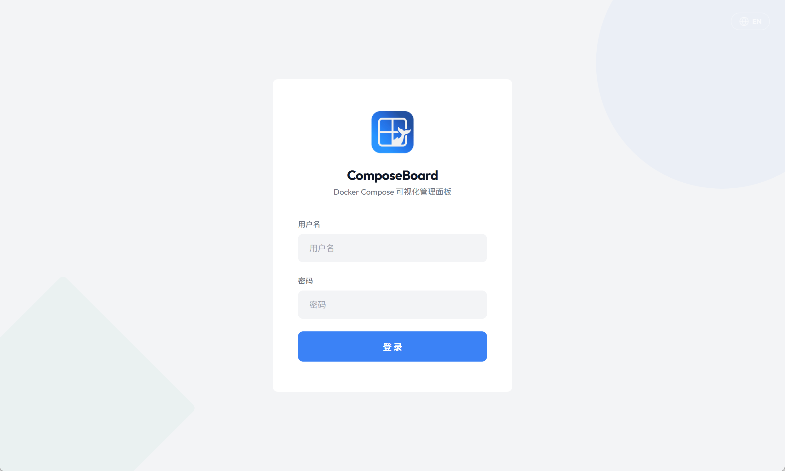
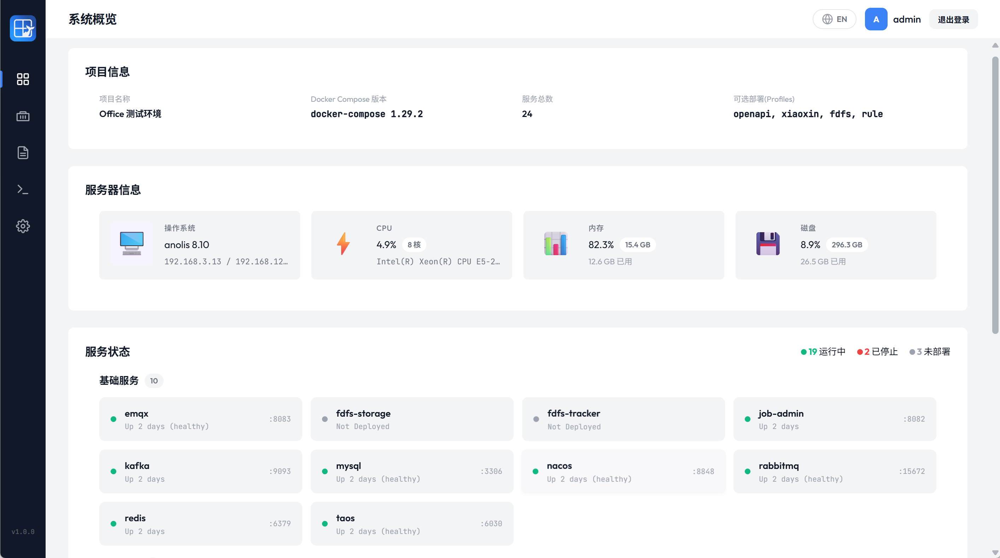
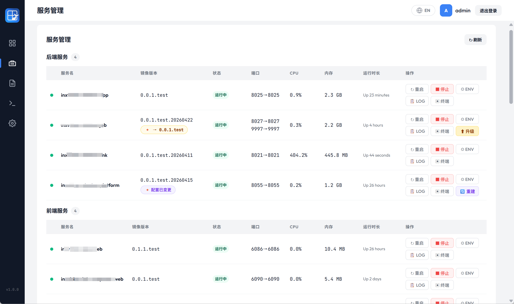
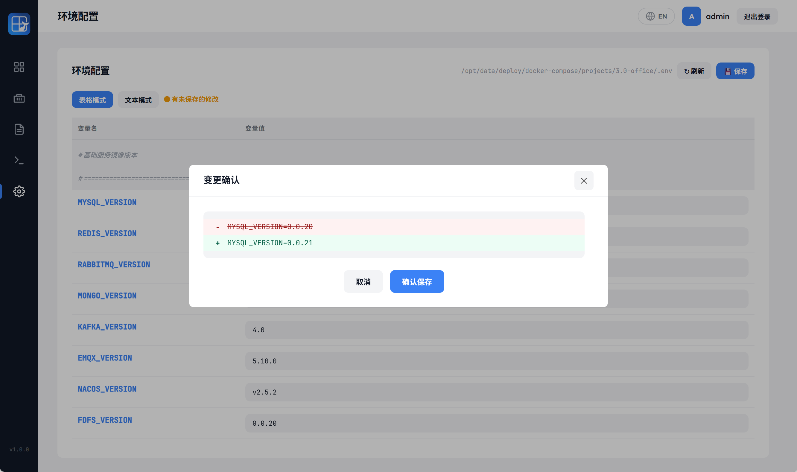
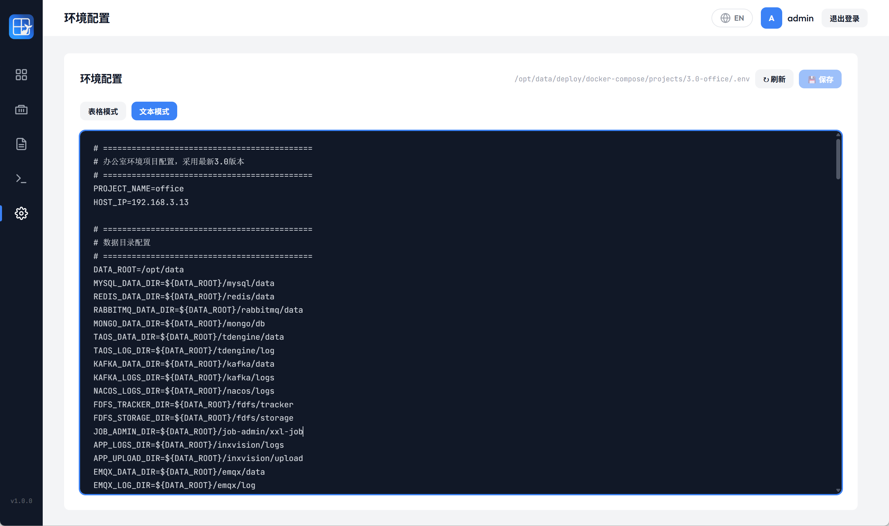
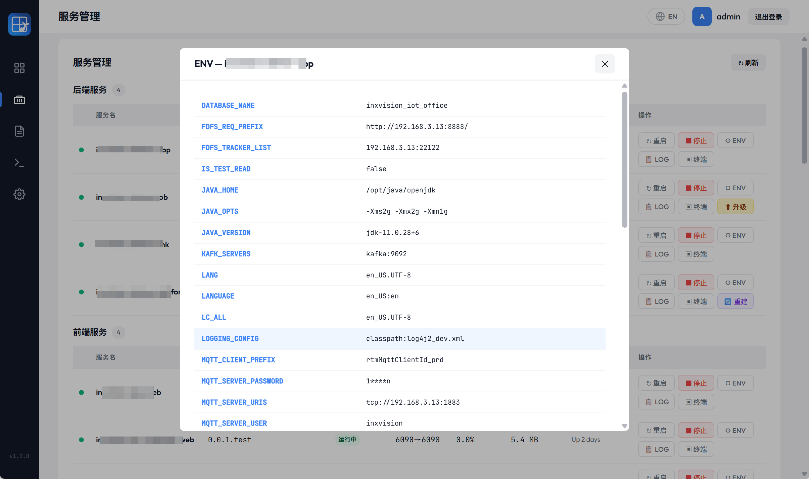
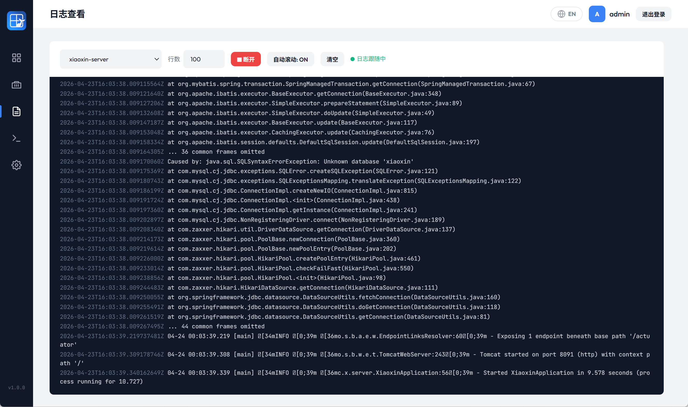
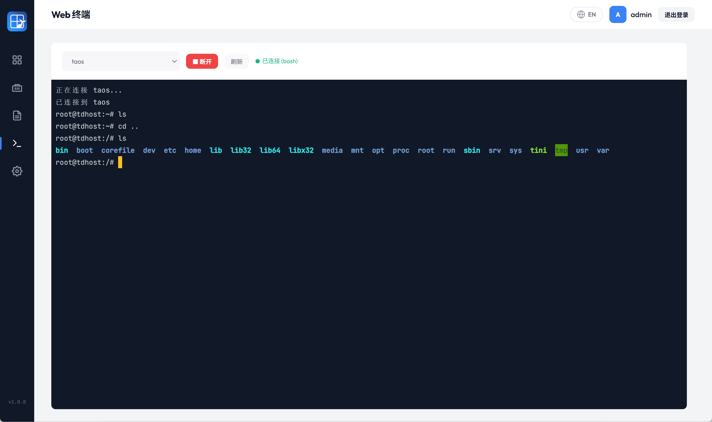

# ComposeBoard 编译、部署和使用手册

> 面向开发者、部署人员和最终使用者。本文说明如何从源码编译、如何部署运行、如何配置 Compose 项目，以及如何使用主要功能。本文适用于 v1.2.0，并包含从 v1.1.3 升级的配置迁移步骤。

## 1. 准备条件

### 1.1 运行 ComposeBoard

| 条件         | 要求                                                                            |
| ---------- | ----------------------------------------------------------------------------- |
| Docker     | 本机 Docker daemon 正常运行                                                         |
| Compose    | `docker compose` 或 `docker-compose` 可执行                                       |
| Compose 项目 | 已存在 `compose.yaml`、`compose.yml`、`docker-compose.yml` 或 `docker-compose.yaml` |
| 浏览器        | 可访问 ComposeBoard 监听端口                                                         |

### 1.2 从源码编译

| 条件      | 要求                                         |
| ------- | ------------------------------------------ |
| Go      | 与 `go.mod` 一致，当前为 Go 1.25                  |
| Node.js | 仅用于执行 `scripts/check-i18n-keys.js`，前端无打包步骤 |
| Git     | 可选，用于版本号注入                                 |

## 2. 下载或准备二进制

按目标系统选择二进制文件：

| 系统            | 文件                               |
| ------------- | -------------------------------- |
| Linux amd64   | `composeboard-linux-amd64`       |
| Linux arm64   | `composeboard-linux-arm64`       |
| Windows amd64 | `composeboard-windows-amd64.exe` |
| Windows arm64 | `composeboard-windows-arm64.exe` |
| macOS amd64   | `composeboard-darwin-amd64`      |
| macOS arm64   | `composeboard-darwin-arm64`      |

二进制已经内置前端资源，只需要一个配置文件即可运行。

## 3. 配置文件

复制模板：

```powershell
Copy-Item config.yaml.template config.yaml
```

编辑 `config.yaml`：

```yaml
server:
  host: "0.0.0.0"
  port: 9090

project:
  dir: "/opt/compose-project"
  name: "我的项目"

auth:
  username: "admin"
  password: "changeme"
  jwt_secret: "please-change-this-secret"

compose:
  command: "auto"

file_logs:
  enabled: true
  allowed_bases:
    - id: project-data
      name: 项目数据目录
      path: /opt/data
  follow_extensions: [".log"]
  download_extensions: [".log", ".gz"]
  discovery:
    max_depth: 2
    max_entries: 2000
    timeout_ms: 300
    cache_ttl_seconds: 60
```

关键说明：

| 配置                | 说明                                                     |
| ----------------- | ------------------------------------------------------ |
| `project.dir`     | 必须指向真实 Compose 项目目录                                    |
| `project.name`    | 只影响 UI 展示，不影响 Docker 项目匹配                              |
| `compose.command` | 推荐 `auto`，程序优先检测 `docker compose`，再检测 `docker-compose` |
| `auth.password`   | 必须修改默认值                                                |
| `auth.jwt_secret` | 生产环境建议固定配置                                             |
| `file_logs.enabled` | 可选能力；缺失或为 `false` 时界面和旧版本一致 |

`allowed_bases` 是服务端安全边界，不会被全量递归浏览。自动发现只检查当前服务位于基准目录内的 Docker/Compose 挂载，并受深度、条目数和时间预算限制；匹配失败时不默认其他服务目录。`.log` 默认可实时跟随和下载，`.gz` 只下载。基准路径只是授权范围，不证明该路径属于独立磁盘；生产环境应使用 `df` 或系统挂载配置确认 `DATA_ROOT` 确实位于目标数据盘。

人工配置只保存 `base_id + relative_path` 到项目目录的 `.composeboard-file-logs.json`，可复制到相同服务和相对目录结构的其他项目。浏览器不能新增绝对基准目录，服务端每次查看、下载和保存仍会校验路径边界、符号链接和普通文件类型。

本工作区的 `install-composeboard.sh` 只读取项目 `.env` 的 `DATA_ROOT`，将规范化后的非根绝对路径固化为 `project-data`；未检测到安全的 `DATA_ROOT` 时保持文件日志关闭。

## 4. 运行方式

### 4.1 Windows 运行

在 PowerShell 中执行：

```powershell
.\composeboard-windows-amd64.exe -config .\config.yaml
```

如果 Docker Desktop 正常运行，ComposeBoard 会通过 Windows Named Pipe 连接 Docker：

```text
\\.\pipe\docker_engine
```

访问：

```text
http://127.0.0.1:9090
```

### 4.2 Linux 运行

```bash
chmod +x ./composeboard-linux-amd64
./composeboard-linux-amd64 -config ./config.yaml
```

ComposeBoard 会通过 Unix Socket 连接 Docker：

```text
/var/run/docker.sock
```

如果当前用户没有 Docker socket 权限，可使用具备 Docker 权限的用户运行，或将用户加入 `docker` 组后重新登录。

### 4.3 macOS 运行

```bash
chmod +x ./composeboard-darwin-arm64
./composeboard-darwin-arm64 -config ./config.yaml
```

macOS 需要 Docker Desktop 提供可访问的 Docker socket。若 `/var/run/docker.sock` 不存在或不可访问，需要先检查 Docker Desktop 设置。

## 5. Linux systemd 示例

将二进制和配置放到：

```text
/opt/composeboard/
```

示例 unit：

```ini
[Unit]
Description=ComposeBoard
After=network.target docker.service
Requires=docker.service

[Service]
Type=simple
WorkingDirectory=/opt/composeboard
ExecStart=/opt/composeboard/composeboard-linux-amd64 -config /opt/composeboard/config.yaml
Restart=always
RestartSec=3
User=root

[Install]
WantedBy=multi-user.target
```

常用命令：

```bash
systemctl daemon-reload
systemctl enable composeboard
systemctl start composeboard
systemctl status composeboard
journalctl -u composeboard -f
```

> 如果不希望使用 root，请确保运行用户拥有 Docker socket 访问权限，并能读写目标 Compose 项目目录中的 `.env` 和 `.composeboard-state.json`。

## 6. 反向代理建议

生产环境建议将 ComposeBoard 放在 HTTPS 反向代理后。

Nginx 示例：

```nginx
server {
    listen 443 ssl;
    server_name composeboard.example.com;

    ssl_certificate     /path/to/fullchain.pem;
    ssl_certificate_key /path/to/privkey.pem;

    location / {
        proxy_pass http://127.0.0.1:9090;
        proxy_http_version 1.1;
        proxy_set_header Host $host;
        proxy_set_header X-Real-IP $remote_addr;
        proxy_set_header X-Forwarded-For $proxy_add_x_forwarded_for;
        proxy_set_header X-Forwarded-Proto $scheme;
    }

    location /api/services/ {
        proxy_pass http://127.0.0.1:9090;
        proxy_http_version 1.1;
        proxy_set_header Host $host;
        proxy_set_header Upgrade $http_upgrade;
        proxy_set_header Connection "upgrade";
        proxy_buffering off;
    }
}
```

说明：

- Web 终端需要 WebSocket upgrade。
- 实时日志使用 SSE，建议关闭代理缓冲。
- 如果暴露到公网，建议叠加 IP 白名单、VPN 或统一认证网关。

## 7. 从源码编译

### 7.1 Windows PowerShell 编译当前平台

```powershell
$env:CGO_ENABLED = "0"
go build -ldflags "-s -w" -o bin\composeboard.exe .
```

运行：

```powershell
.\bin\composeboard.exe -config .\config.yaml
```

### 7.2 Windows PowerShell 交叉编译 Linux amd64

```powershell
$env:GOOS = "linux"
$env:GOARCH = "amd64"
$env:CGO_ENABLED = "0"
go build -ldflags "-s -w" -o bin\composeboard-linux-amd64 .
Remove-Item Env:\GOOS
Remove-Item Env:\GOARCH
Remove-Item Env:\CGO_ENABLED
```

### 7.3 Windows PowerShell 全平台编译示例

按目标逐个设置环境变量并执行 `go build`：

```powershell
$env:GOOS = "linux"
$env:GOARCH = "amd64"
$env:CGO_ENABLED = "0"
go build -ldflags "-s -w" -o bin\composeboard-linux-amd64 .

$env:GOOS = "linux"
$env:GOARCH = "arm64"
go build -ldflags "-s -w" -o bin\composeboard-linux-arm64 .

$env:GOOS = "windows"
$env:GOARCH = "amd64"
go build -ldflags "-s -w" -o bin\composeboard-windows-amd64.exe .

$env:GOOS = "windows"
$env:GOARCH = "arm64"
go build -ldflags "-s -w" -o bin\composeboard-windows-arm64.exe .

$env:GOOS = "darwin"
$env:GOARCH = "amd64"
go build -ldflags "-s -w" -o bin\composeboard-darwin-amd64 .

$env:GOOS = "darwin"
$env:GOARCH = "arm64"
go build -ldflags "-s -w" -o bin\composeboard-darwin-arm64 .

Remove-Item Env:\GOOS
Remove-Item Env:\GOARCH
Remove-Item Env:\CGO_ENABLED
```

### 7.4 版本号注入

```powershell
$version = "v1.2.0"
$buildTime = Get-Date -Format "yyyy-MM-dd_HH:mm:ss"
go build -ldflags "-s -w -X main.Version=$version -X main.BuildTime=$buildTime" -o bin\composeboard.exe .
```

### 7.5 Makefile

当前 Makefile 提供：

```text
make build
make build-linux
make build-arm
make build-all
make i18n-check
```

注意：Makefile 中部分命令使用 Unix shell 语法，更适合 Linux/macOS 或 CI 环境。在 Windows 本地建议使用 PowerShell 编译命令。

## 8. 校验

### 8.1 i18n key 校验

```powershell
node scripts\check-i18n-keys.js
```

该脚本检查 `web/js/locales/zh.json` 与 `web/js/locales/en.json` 是否保持 key 对称。

### 8.2 Go 测试

```powershell
$env:GOCACHE = (Join-Path (Get-Location) '.gocache-compose-board')
go test ./...
Remove-Item Env:\GOCACHE
```

## 9. Compose 项目适配

### 9.1 推荐设置 `COMPOSE_PROJECT_NAME`

在目标 Compose 项目的 `.env` 中配置：

```dotenv
COMPOSE_PROJECT_NAME=myproject
```

这样即使目录名变化，ComposeBoard 仍能稳定匹配 Docker Compose 生成的 project label。

### 9.2 可选服务使用 Profiles

```yaml
services:
  worker:
    image: example/worker:latest
    profiles:
      - worker
```

### 9.3 UI 分类标签

```yaml
services:
  mysql:
    image: mysql:8
    labels:
      com.composeboard.category: base

  api:
    image: example/api:${APP_VERSION}
    labels:
      com.composeboard.category: backend
```

支持值：

| 值          | 展示    |
| ---------- | ----- |
| `base`     | 基础服务  |
| `backend`  | 后端服务  |
| `frontend` | 前端服务  |
| `init`     | 初始化服务 |
| `other`    | 其他    |

没有标签的服务归入 `other`。 日志页两个服务下拉按 `backend → base → frontend → 其他` 稳定分组；同分类、`init`、`other` 和未标记服务都保持 API 原始相对顺序。分类标签不参与文件日志目录发现。

## 10. 使用指南

### 10.1 登录

打开浏览器访问 ComposeBoard 地址，输入 `config.yaml` 中配置的账号密码。



### 10.2 查看系统概览

系统概览页用于查看项目、主机、Docker 和服务统计。



### 10.3 管理服务

进入“服务管理”：

- 查看运行、停止、未部署服务。
- 对运行中服务执行停止、重启、日志、终端操作。
- 对停止服务执行启动。
- 对未部署且无 Profile 的 `image:` 服务执行启动。
- 对镜像有差异的服务执行升级。
- 对 `.env` 变更影响的服务执行重建。



### 10.4 管理 Profiles

在服务管理页，可选服务会按 Profile 分组：

- 点击启用 Profile，会执行整组启动。
- 点击停用 Profile，会停止并移除该 Profile 下服务容器。
- 停用前会展示确认弹窗。

### 10.5 编辑 `.env`

进入“环境配置”：

- 表格模式适合普通 key/value 修改。
- 文本模式适合批量编辑、保留复杂格式。
- 保存前会展示差异。
- 保存后会自动备份原 `.env`。



文本模式：



### 10.6 查看服务运行时环境变量

服务管理页点击 `ENV`：



敏感变量会脱敏展示。

### 10.7 查看日志

进入“日志查看”，选择服务并连接：



说明：

- `tail` 控制初始历史日志行数。
- 实时日志基于 SSE。
- 如果服务重建导致容器 ID 变化，日志流会尝试重连。
配置文件日志后，工具栏首项出现“容器控制台 / 文件日志”来源下拉，与服务、目录、文件和操作按钮保持同一行。文件日志模式按“服务 → 服务级候选目录 → 文件”选择：

- 目录推荐只来自当前服务位于安全基准目录内的实际 Docker Mounts、Compose volumes 和有限路径探测，不要求额外 Labels。
- 明确的日志语义挂载即使为空也可成为候选；同一日志树中的父目录和 Nacos 等子挂载会归并，不互相制造匹配冲突。
- 自动匹配不唯一或没有候选时不会默认第一个目录，可点击齿轮按层浏览或输入相对路径。
- 人工配置保存到 `.composeboard-file-logs.json`；“恢复自动匹配”可删除覆盖配置。
- 当前普通日志可连接实时跟随，也可下载；`.gz` 压缩归档仅开放下载。
- 日志轮转或截断时，同名文件会自动重新打开并继续跟随。
- 文件按最终后缀匹配白名单；`config.log.日期.1` 等文件默认不列出，需调整命名/压缩策略或显式扩展下载白名单。

### 10.8 打开 Web 终端

进入“终端”或从服务管理页点击终端按钮：



注意：

- 只有 running 服务可连接。
- 断开后重新连接会创建新的 shell。
- 当前不记录命令审计日志。

### 10.9 切换语言

登录页和顶部栏提供语言切换按钮。当前支持中文和 English。

## 11. 升级 ComposeBoard 自身

### 11.1 从 v1.1.3 升级到 v1.2.0

v1.1.3 的 `config.yaml` 可以直接启动 v1.2.0。缺少 `file_logs` 时功能保持关闭，Docker 控制台日志和其他页面行为与旧版一致。

需要启用文件日志时，在原配置中追加：

    file_logs:
      enabled: true
      allowed_bases:
        - id: project-data
          name: 项目数据目录
          path: /opt/data
      follow_extensions: [".log"]
      download_extensions: [".log", ".gz"]
      discovery:
        max_depth: 2
        max_entries: 2000
        timeout_ms: 300
        cache_ttl_seconds: 60

升级步骤：

1. 备份 v1.1.3 二进制和 `config.yaml`。
2. 根据 `uname -m` 选择 v1.2.0 amd64 或 arm64 二进制，并核对发布目录中的 `SHA256SUMS`。
3. 将项目非根 `DATA_ROOT` 固化为 `allowed_bases[].path`；不要把 `/`、`/etc` 或用户可变输入作为基准目录。
4. 原子替换二进制和配置后重启 ComposeBoard。
5. 重新登录并验证版本、控制台日志、文件日志、下载、服务排序和 Web 终端。
6. 确认稳定后再清理旧二进制和配置备份。

ComposeBoard 自身升级不会自动重建业务容器。若同时增加日志 bind mount 或应用日志路径环境变量，新挂载只有在运维人员执行 Compose 重建后才会生效。

公共安装脚本会读取项目 `.env` 的安全非根 `DATA_ROOT` 并生成上述配置；无法确定安全路径时保持文件日志关闭。

### 11.2 通用替换流程

推荐流程：

1. 停止当前 ComposeBoard 进程或服务。
2. 备份旧二进制和 `config.yaml`。
3. 替换为新二进制。
4. 启动并观察日志。
5. 登录检查 Dashboard、服务列表、日志和终端。

Linux systemd：

```bash
systemctl stop composeboard
cp /opt/composeboard/composeboard-linux-amd64 /opt/composeboard/composeboard-linux-amd64.bak
cp ./composeboard-linux-amd64 /opt/composeboard/composeboard-linux-amd64
chmod +x /opt/composeboard/composeboard-linux-amd64
systemctl start composeboard
journalctl -u composeboard -f
```

## 12. 常见故障

### 12.1 启动时报 `project.dir 不能为空`

检查 `config.yaml`：

```yaml
project:
  dir: "/实际/Compose/项目目录"
```

### 12.2 启动时报找不到 Compose 命令

确认以下命令至少一个可用：

```powershell
docker compose version
docker-compose version
```

也可以在配置中指定：

```yaml
compose:
  command: "docker compose"
```

### 12.3 服务列表为空

排查顺序：

1. `project.dir` 是否正确。
2. Compose 文件名是否为支持的四种之一。
3. `.env` 中 `COMPOSE_PROJECT_NAME` 是否与实际部署项目一致。
4. 目标容器是否由 Docker Compose 创建。
5. 当前用户是否能访问 Docker daemon。

### 12.4 服务显示未部署，但容器实际存在

通常是项目名 label 不一致。检查目标容器：

```bash
docker inspect <container> --format '{{ index .Config.Labels "com.docker.compose.project" }}'
docker inspect <container> --format '{{ index .Config.Labels "com.docker.compose.service" }}'
```

确保 ComposeBoard 检测到的 project name 与容器 label 一致。

### 12.5 `.env` 保存失败

检查运行 ComposeBoard 的用户是否对项目目录有写权限。保存 `.env` 时需要：

- 读取 `.env`
- 创建 `.env.bak.*`
- 写回 `.env`
- 写入或更新 `.composeboard-state.json`

### 12.6 Web 终端无法连接

排查：

1. 服务是否为 running。
2. 容器内是否有 `bash` 或 `/bin/sh`。
3. 反向代理是否支持 WebSocket upgrade。
4. JWT token 是否过期。
5. 是否超过默认 8 个活跃终端会话。

### 12.7 实时日志一直 waiting

可能原因：

- 服务未运行。
- 容器正在重建。
- Docker logs API 暂不可用。
- 反向代理缓冲导致 SSE 不及时。

可先查看历史日志接口是否正常。

### 12.8 文件日志目录已匹配但文件下拉为空

按以下顺序检查：

1. 宿主机候选目录是否真的存在允许后缀文件。
2. 容器内应用实际写入路径是否与 bind mount 目标一致。
3. 应用是否缺少 `LOG_PATH`、`LOGGING_PATH` 等日志路径变量。
4. 文件名最终后缀是否命中 `follow_extensions` 或 `download_extensions`。
5. 业务容器是否已在修改 Compose 后重新创建；只修改 YAML 不会改变现有容器挂载。

目录能自动匹配只说明挂载关系可信，不保证应用已经向该目录写入文件。

### 12.9 主日志目录和子日志挂载同时出现

v1.2.0 会把同一 `base_id` 下互为父子的高可信目录归并为一棵日志树，自动选择评分最高的服务主目录，并保留 Nacos 等子目录供手动切换。

如果仍为 `unmatched`：

- 点击刷新重新发现，或确认 Compose 文件和容器 ID 已被重新加载。
- 检查候选是否实际位于互不相关的目录；这类情况应人工选择或保存映射。
- 不要通过扩大 `allowed_bases` 或扫描整个数据根目录规避歧义。

### 12.10 Nacos 等轮转文件未显示

默认下载后缀为 `.log` 和 `.gz`。类似 `config.log.2026-08-24.1` 的最终后缀是 `.1`，因此不会列出。活动的 `config.log`、`naming.log`、`remote.log` 可以正常查看和下载。

## 13. 发布前检查清单

| 检查项     | 命令或动作                             |
| ------- | --------------------------------- |
| Go 测试   | `go test ./...`                   |
| 服务排序    | `node scripts\test-service-order.js` |
| i18n 校验 | `node scripts\check-i18n-keys.js` |
| 二进制启动   | 使用测试 `config.yaml` 启动             |
| 登录      | 验证账号密码和 token 过期处理                |
| 服务列表    | 验证 running、exited、not_deployed    |
| Profile | 验证启用和停用                           |
| `.env`  | 验证表格和文本模式保存、备份、重建提示               |
| 日志      | 验证控制台/文件切换、未匹配、嵌套挂载、轮转、下载和 Range |
| 终端      | 验证 running 服务连接和 resize           |
| 文档      | 检查 README、截图、链接和许可证               |

 

## 作者信息

作者：凌封  
作者主页：[https://fengin.cn](https://fengin.cn)  
AI 全书：[https://aibook.ren](https://aibook.ren) 
GitHub：[https://github.com/fengin/compose-board](https://github.com/fengin/compose-board)
