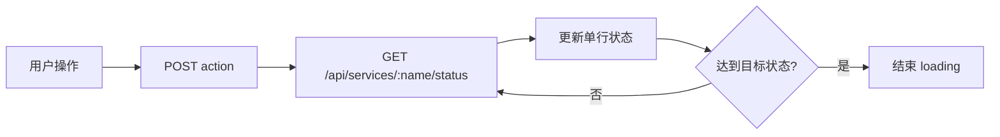

# ComposeBoard 开发规范文档

> 面向维护者和贡献者。本文定义后续开发、修复、重构和文档维护时需要遵守的工程规范，确保项目保持轻量、清晰、可维护。

## 1. 总体原则

1. 以代码实现为准。开发期文档仅作背景参考，对外文档和新设计必须反向校准当前实现。
2. 保持架构分层。不要把业务规则写进 HTTP Handler，也不要把 Compose 解析写进 Docker Client。
3. 轻量优先。新增依赖必须有明确收益，避免引入构建系统、数据库或重型前端框架链路。
4. 离线优先。用户可见页面不得依赖外部 CDN、在线字体或公网资源。
5. 声明态优先。服务主视图继续以 Compose YAML 为基础，再融合 Docker 运行态。
6. 标签驱动。容器识别依赖 Docker Compose 原生 label，UI 分类依赖 `com.composeboard.category`，禁止恢复服务名猜测分类。
7. 边界清晰。当前产品聚焦单机、单项目、单副本 Docker Compose，不把 Kubernetes、远程 Docker、多项目平台混入核心实现。

## 2. 架构边界

| 模块                  | 可以做                                     | 不应该做                        |
| ------------------- | --------------------------------------- | --------------------------- |
| `main.go`           | 初始化、依赖注入、路由注册、静态文件服务                    | 业务裁决                        |
| `internal/api`      | 参数解析、认证后入口、HTTP 状态码、响应封装                | 直接解析 YAML、直接访问 Docker 做复杂业务 |
| `internal/service`  | 生命周期、升级、状态文件、Profile、服务视图聚合             | HTTP 细节、前端状态                |
| `internal/compose`  | Compose 文件发现、YAML 解析、`.env` 解析写入、CLI 调用 | Docker Engine API           |
| `internal/docker`   | Docker Engine API、Transport、缓存、Exec     | Compose YAML 解析、业务状态机       |
| `internal/terminal` | WebSocket 到 Docker Exec 的会话管理           | 服务操作规则                      |
| `web/js/pages`      | 页面状态、交互编排                               | 后端业务最终裁决                    |
| `web/js/components` | 可复用 UI 组件                               | 页面级复杂业务                     |

新增功能前应先判断它属于哪个层，避免跨层直接调用。

## 3. 文件头注释

新增 Go、JavaScript、CSS、HTML 文件应包含产品与作者信息。

Go：

```go
// ComposeBoard - Docker Compose 可视化管理面板
// 作者：凌封
// 网址：https://fengin.cn
```

JavaScript：

```javascript
/**
 * ComposeBoard - Docker Compose 可视化管理面板
 * 作者：凌封
 * 网址：https://fengin.cn
 */
```

CSS：

```css
/*
 * ComposeBoard - Docker Compose 可视化管理面板
 * 作者：凌封
 * 网址：https://fengin.cn
 */
```

HTML：

```html
<!--
  ComposeBoard - Docker Compose 可视化管理面板
  作者：凌封
  网址：https://fengin.cn
-->
```

## 4. Go 规范

### 4.1 基本规则

- 使用标准 `gofmt`。
- 包名使用小写短单词，例如 `api`、`service`、`compose`、`docker`。
- 日志使用清晰模块前缀，例如 `[SERVICE]`、`[DOCKER]`、`[TERMINAL]`。
- 所有 Docker、Compose、网络和文件操作应有明确错误返回。
- 可能阻塞的外部调用必须有 `context` 和超时。
- 公开类型和函数应有必要注释。

### 4.2 错误处理

业务错误应尽量携带稳定错误码，便于前端 i18n：

```go
return &ServiceError{
    Code:    "services.start.profile_required",
    Message: "可选服务需要先启用 Profile",
}
```

API 层负责把业务错误映射到 HTTP 状态码。

### 4.3 Docker 调用

- 容器列表必须使用 `com.docker.compose.project` label 过滤。
- 单服务查询必须同时使用 project 和 service label。
- 不要通过容器名解析服务名。
- 对 Docker Engine API 的长耗时调用要设置超时。
- 日志和终端这类流式接口要考虑客户端断开后的资源释放。

### 4.4 Compose 调用

- Compose CLI 调用统一经过 `compose.Executor`。
- `docker compose` 和 `docker-compose` 的参数差异必须在 Executor 中收敛。
- 子命令执行时必须显式传入 `-f` 和 `--project-directory`，确保 CLI 与 parser 使用同一个 Compose 文件。
- 未部署 `build:` 服务不要绕过当前边界直接做构建启动，除非先完成部署向导设计。

## 5. 前端规范

### 5.1 基本规则

- 当前前端无构建步骤，保持静态脚本直接加载。
- 用户可见文本必须使用 `$t('key')`。
- 新增文案必须同时维护 `zh.json` 和 `en.json`。
- 页面级状态放在 `web/js/pages`。
- 可复用展示组件放在 `web/js/components`。
- API 调用统一经过 `web/js/api.js`。
- 避免在多个页面重复定义状态文案、错误文案和分类文案。

### 5.2 i18n

新增或修改文案后执行：

```powershell
node scripts\check-i18n-keys.js
```

要求：

- `zh.json` 与 `en.json` key 完全对称。
- key 使用模块化命名，例如 `services.actions.start`。
- 不把后端中文错误原文直接展示给最终用户，优先使用错误码映射。

### 5.3 UI 和交互

- 保持现有扁平化、轻量、专业的视觉风格。
- 管理类页面优先信息密度和可扫描性，不做营销式大卡片堆叠。
- 服务操作按钮要基于状态机展示，不能只靠前端猜测最终结果。
- 长操作需要 loading、超时和失败反馈。
- 日志、终端等实时页面要处理断开、重连和资源释放。
- 不引入外部图标 CDN、字体 CDN 或在线资源。

## 6. API 设计规范

1. 路径使用资源语义，例如 `/api/services/:name/restart`。
2. 新接口默认放在 `/api` 认证组下。
3. WebSocket 接口需要支持 query token。
4. 返回结构应稳定，避免前端依赖不确定字段。
5. 错误响应尽量包含 `code` 和 `error`：

```json
{
  "code": "services.not_deployed",
  "error": "服务未部署"
}
```

6. 流式接口需要明确 Content-Type：

| 类型       | Content-Type               |
| -------- | -------------------------- |
| SSE      | `text/event-stream`        |
| JSON     | `application/json`         |
| SPA HTML | `text/html; charset=utf-8` |

## 7. 状态同步规范

服务操作后不要只等待固定时间刷新全量列表，应按当前模式走单服务实时状态轮询：



Profile 启用/停用是组操作，前端应对组内服务逐个轮询。

## 8. `.env` 规范

- 读写 `.env` 必须通过 `compose/env.go`。
- 保存前必须备份。
- 保存后必须调用 `ServiceManager.ReloadCompose()`。
- `.env` 变量展开只使用 `.env` 内容，不读取 `os.Environ()`，保证结果可复现。
- image 字段引用变量的变化应进入 `image_diff`，非 image 服务配置变量变化进入 `pending_env`。

## 9. Web 终端规范

- 仅 running 服务可连接。
- 一个 WebSocket 对应一个 Docker Exec 会话。
- 断开后不恢复旧会话，重新连接创建新 shell。
- 终端输出以 binary frame 传输。
- 控制消息使用 JSON text frame。
- resize 失败只记录服务端日志，不打断终端。
- 不记录用户命令输入和终端输出，除非后续明确设计审计能力。

## 10. 测试规范

### 10.1 必跑检查

```powershell
node scripts\check-i18n-keys.js
```

```powershell
$env:GOCACHE = "D:\code\work\deploy\.gocache-compose-board"
go test ./...
Remove-Item Env:\GOCACHE
```

### 10.2 建议覆盖

| 变更类型       | 建议验证                                      |
| ---------- | ----------------------------------------- |
| Compose 解析 | YAML 文件发现、labels、profiles、depends_on、变量引用 |
| `.env`     | 注释、空行、引号、变量展开、备份、保存                       |
| 服务操作       | running、exited、not_deployed、build、profile |
| 日志         | 长日志行、容器重建、SSE 状态事件                        |
| 终端         | shell 探测、resize、主动关闭、异常断开                 |
| 前端         | 中英文切换、状态按钮、错误提示、截图检查                      |

## 11. 文档规范

- 对外文档放在 `docs/` 根层级。
- 开发过程文档、评审记录、决策讨论放在 `docs/dev/`。
- README 根目录保留中文 `ReadMe.md` 和英文 `ReadMe.en.md`。
- 对外文档应以当前代码实现为准，不把规划能力写成已实现。
- 有交互或架构说明时优先使用 Mermaid 图和 `docs/ui` 截图。
- 图片路径在根 README 中使用 `docs/ui/...`，在 `docs` 内文档中使用 `ui/...`。

## 12. Windows 开发注意事项

本项目维护环境包含 Windows。维护时应注意：

- PowerShell 不使用 `&&` 拼接命令。
- 批量文件替换禁止使用 PowerShell `Set-Content` / `Get-Content` 组合，避免破坏 UTF-8 编码。
- Windows 路径示例使用反斜杠。
- 跨平台代码应通过 build tag 区分，例如 Docker Transport 的 `windows` 和 `!windows` 实现。
- 新增脚本要考虑 Windows 使用者的执行体验。

## 13. 依赖规范

新增依赖前必须回答：

1. 是否能用标准库或现有依赖完成？
2. 是否会显著增加二进制体积？
3. 是否引入运行时外部服务？
4. 是否破坏离线部署？
5. 是否对 Windows/Linux/macOS 都可用？

当前核心依赖包括 Gin、JWT、gorilla/websocket、gopsutil、yaml.v3、go-winio。

## 14. 发布检查清单

| 检查   | 要求                                      |
| ---- | --------------------------------------- |
| 版本号  | 编译时注入 `main.Version`                    |
| 测试   | `go test ./...` 通过                      |
| i18n | key 对称                                  |
| 构建   | Linux、Windows、macOS 的 amd64/arm64 产物可生成 |
| 资源   | 前端 vendor、字体、xterm 样式都被内嵌               |
| 文档   | README、产品文档、部署手册、技术参数更新                 |
| 截图   | `docs/ui` 截图与当前界面一致                     |
| 配置   | `config.yaml.template` 与代码字段一致          |
| 许可证  | 根目录应补充 `LICENSE`                        |
| 安全   | 默认密码提示、JWT secret 提示、Web 终端风险提示齐全       |

## 15. 不推荐的改动

- 引入数据库保存状态。
- 把前端改成必须 npm build 才能运行。
- 把分类逻辑改回服务名关键词匹配。
- 在 API Handler 中堆业务流程。
- 在 Docker Client 中解析 Compose YAML。
- 把远程 Docker、多项目、部署向导混入当前服务管理状态机。
- 在 Web 终端中记录命令和输出但没有审计设计。
- 将第三方资源改成在线 CDN。


## 作者信息

作者：凌封  
作者主页：[https://fengin.cn](https://fengin.cn)  
AI 全书：[https://aibook.ren](https://aibook.ren)  
GitHub：[https://github.com/fengin/compose-board](https://github.com/fengin/compose-board)
