# ComposeBoard 产品功能说明书

> 面向使用者、运维人员、项目负责人和产品选型人员。本文说明 ComposeBoard 解决什么问题、适合哪些场景、有哪些功能、与同类产品的差异，以及当前版本的边界。

## 1. 产品概述

ComposeBoard 是一个轻量级 Docker Compose 可视化管理面板。它以已有 Compose 项目目录为管理对象，通过浏览器完成服务状态查看、启停、升级、重建、Profile 分组管理、`.env` 配置编辑、日志查看和 Web 终端连接。

它的核心设计目标是“保持 Compose 的简单性”。用户不需要把项目迁移到新的平台，也不需要引入数据库、镜像仓库代理、Kubernetes 或额外运维体系。ComposeBoard 只做单机 Compose 项目的日常可视化运维补位。

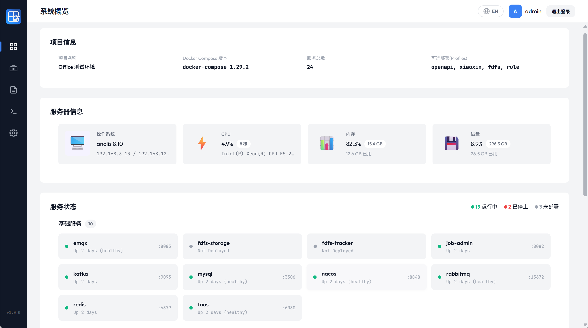

## 2. 解决的问题

很多中小型服务、私有化部署、演示环境、预生产环境、边缘节点和内部工具都采用 Docker Compose 管理。纯命令行方式稳定直接，但在日常维护中常见以下问题：

| 问题                    | ComposeBoard 的处理方式                  |
| --------------------- | ----------------------------------- |
| 不方便查看所有声明服务           | 读取 Compose YAML，展示全部声明服务，包括未部署服务    |
| 容器名不稳定或难以识别           | 使用 Docker Compose 原生 label 识别项目和服务  |
| 可选服务缺少清晰分组            | 识别 Compose Profiles，并按 profile 分组管理 |
| 镜像版本是否需要升级不直观         | 对 `image:` 服务展开 `.env` 后比较声明镜像和运行镜像 |
| `.env` 修改后哪些服务需要重建不明确 | 记录已生效状态，提示受影响变量和服务                  |
| 查看日志需要登录服务器           | 浏览器内查看历史日志和实时日志                     |
| 排查容器问题需要 SSH 到宿主机     | 浏览器内通过 Docker Exec 打开运行中容器终端        |
| 大平台太重                 | 单文件运行，低内存占用，无数据库                    |

## 3. 适用场景

| 场景                         | 适用性     | 说明                                |
| -------------------------- | ------- | --------------------------------- |
| 单机 Docker Compose 生产或预生产项目 | 适合      | 适合一个实例管理一个 Compose 项目             |
| 私有化部署交付                    | 适合      | 可随项目一起提供给客户或运维人员                  |
| 边缘设备和低配云服务器                | 适合      | 运行时资源占用低                          |
| 多套环境并行                     | 适合      | 每个 Compose 项目部署一个 ComposeBoard 实例 |
| 开发、测试、演示环境                 | 适合      | 服务状态、日志和终端能力可以提升排障效率              |
| 多项目统一平台                    | 不适合当前版本 | 当前配置中 `project.dir` 为单值           |
| Kubernetes / Swarm / 集群管理  | 不适合     | 产品边界是 Docker Compose              |
| 复杂权限、多用户审计                 | 不适合当前版本 | 当前只有配置文件账号密码和 JWT 登录              |

## 4. 产品优势

### 4.1 轻量化

ComposeBoard 是一个 Go 单文件程序，前端资源通过 `go:embed` 内嵌，不依赖数据库、Node.js 运行时、外部 CDN 或独立 Web 服务器。开发测试数据中，休眠状态内存占用约 20 MB，活跃操作约 25~28 MB，CPU占用几乎为零。

### 4.2 声明态优先

传统容器面板通常以“当前容器”为主视图，未部署服务不会出现。ComposeBoard 先解析 Compose 文件，再把 Docker 运行态 LEFT JOIN 到声明服务上，因此可以看到：

- 已运行服务
- 已停止服务
- Compose 中声明但尚未部署的服务
- Profile 下的可选服务
- `image:` 和 `build:` 服务差异

### 4.3 标签驱动而非服务名猜测

ComposeBoard 使用 Docker Compose 自动生成的标签定位容器：

```text
com.docker.compose.project
com.docker.compose.service
```

UI 分类使用可选标签：

```text
com.composeboard.category
```

这避免了“通过服务名包含 mysql / redis / api 之类关键词猜分类”的不稳定做法。

### 4.4 离线优先

Vue、Vue Router、xterm.js、字体、图标和页面资源均内置在二进制中。部署到内网、离线环境或客户现场时，不需要访问公网 CDN。

### 4.5 与同类产品的定位差异

| 维度          | ComposeBoard     | Portainer CE | 1Panel  | Rancher       | Dockge               |
| ----------- | ---------------- | ------------ | ------- | ------------- | -------------------- |
| 主要定位        | 单机 Compose 可视化运维 | 通用容器管理       | 服务器运维面板 | Kubernetes 平台 | Compose 堆栈管理         |
| 资源占用        | 很低，单文件           | 中等           | 中等      | 高             | 低到中等                 |
| 部署方式        | 二进制直接运行          | 容器部署         | 安装脚本    | K8s / 容器      | 容器部署                 |
| `.env` 在线编辑 | 支持               | 部分场景支持       | 非核心能力   | 非核心能力         | 支持                   |
| Web 终端      | 支持               | 支持           | 支持      | 支持            | 当前不作为核心能力            |
| 多项目管理       | 当前不支持            | 支持           | 支持      | 支持            | 支持                   |
| 目标用户        | Compose 项目维护者    | 容器平台用户       | 服务器管理员  | 云原生团队         | HomeLab / Compose 用户 |

> 说明：竞品能力会随版本变化。上表用于说明产品定位差异，不作为对第三方产品的完整评测。

## 5. 功能地图

```mermaid
flowchart TB
    Product["ComposeBoard"]

    Product --> Auth["登录认证"]
    Auth --> AuthJWT["JWT"]
    Auth --> AuthConfig["配置文件账号密码"]

    Product --> Dashboard["系统概览"]
    Dashboard --> ProjectInfo["项目信息"]
    Dashboard --> HostInfo["主机信息"]
    Dashboard --> ServiceStats["服务统计"]

    Product --> Services["服务管理"]
    Services --> Declared["Compose 声明服务"]
    Services --> Runtime["运行态状态"]
    Services --> Lifecycle["启停重启"]
    Services --> Upgrade["升级重建"]
    Services --> Profiles["Profile 分组"]

    Product --> Env["环境配置"]
    Env --> TableMode["表格模式"]
    Env --> TextMode["文本模式"]
    Env --> DiffConfirm["差异确认"]
    Env --> Backup["自动备份"]

    Product --> Logs["日志查看"]
    Logs --> HistoryLogs["历史日志"]
    Logs --> LiveLogs["实时日志"]
    Logs --> LogReconnect["重连跟随"]

    Product --> Terminal["Web 终端"]
    Terminal --> DockerExec["Docker Exec"]
    Terminal --> Xterm["xterm.js"]
    Terminal --> Resize["TTY resize"]

    Product --> I18n["国际化"]
    I18n --> Chinese["中文"]
    I18n --> English["English"]
```

## 6. 功能说明

### 6.1 登录认证

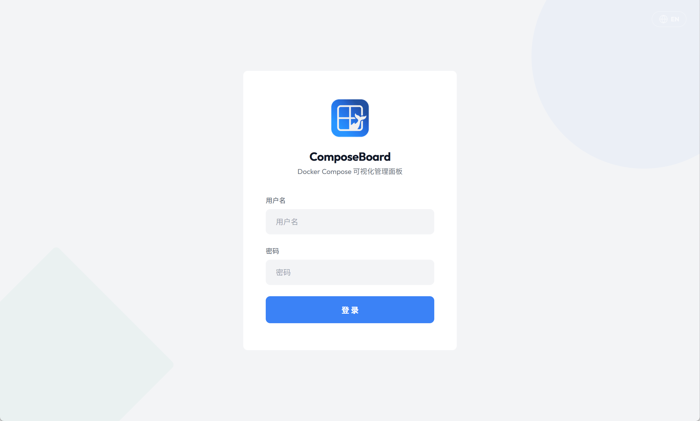

| 功能           | 说明                                                      |
| ------------ | ------------------------------------------------------- |
| 账号密码登录       | 从 `config.yaml` 的 `auth.username` 和 `auth.password` 读取  |
| JWT token    | 登录成功后签发 24 小时 token                                     |
| API 鉴权       | 除 `/api/auth/login` 外，所有 `/api` 路由都需要认证                 |
| WebSocket 鉴权 | Web 终端通过 `?token=<jwt>` 传递 token                        |
| 安全提示         | `jwt_secret` 建议固定配置为高强度随机值；留空时程序会自动生成临时密钥，重启后旧 token 失效 |

当前版本不是多用户系统，不包含角色权限、审计日志和细粒度授权。

### 6.2 系统概览

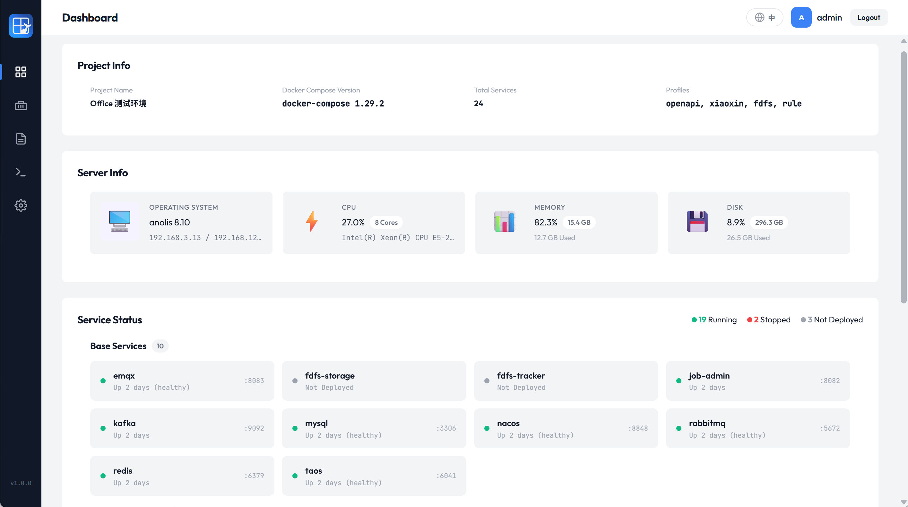

系统概览页用于快速判断项目和宿主机状态：

| 区域        | 内容                                          |
| --------- | ------------------------------------------- |
| 项目信息      | 项目名称、Compose 文件、Compose 命令、版本、服务数量、Profiles |
| 主机信息      | OS、平台、架构、主机 IP 候选列表、CPU、内存、磁盘               |
| Docker 信息 | Docker 版本和 API 版本                           |
| 服务统计      | 运行、停止、未部署服务数量                               |
| 服务分组      | 按 `com.composeboard.category` 展示服务状态概览      |

IP 展示采用候选列表策略，优先展示物理局域网或公网 IPv4，Docker、WSL、Hyper-V、VPN 等虚拟网络地址会降权但不直接丢弃。

### 6.3 服务管理

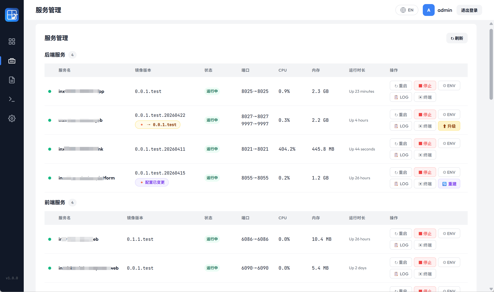

服务管理页是 ComposeBoard 的核心页面。它展示 Compose 文件中的全部服务，并融合 Docker 运行态。

| 字段       | 说明                                  |
| -------- | ----------------------------------- |
| 服务名      | Compose YAML 中的 service key         |
| 镜像版本     | `image:` 展开 `.env` 后的目标镜像，或本地构建标识   |
| 状态       | `running`、`exited`、`not_deployed` 等 |
| 端口       | Docker API 返回的端口映射                  |
| CPU / 内存 | 运行中容器的实时资源数据                        |
| 运行时间     | Docker 容器启动时间                       |
| 操作       | 启动、停止、重启、升级、重建、查看 ENV、查看日志、打开终端     |

服务状态说明：

| 状态                       | 含义                              |
| ------------------------ | ------------------------------- |
| `running`                | 容器正在运行                          |
| `exited`                 | 容器已存在但停止                        |
| `not_deployed`           | Compose 声明存在，但 Docker 中没有对应服务容器 |
| `created` / `restarting` | Docker 当前状态，持续超过阈值时会展示启动异常提示    |

### 6.4 Profile 分组管理

Compose Profiles 用于描述可选服务组。ComposeBoard 按 profile 分组展示可选服务，并提供整组操作。

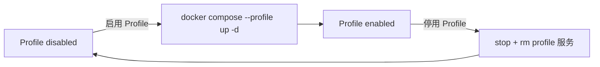

规则：

| 规则          | 说明                                        |
| ----------- | ----------------------------------------- |
| 未启用 profile | 未部署服务不显示单服务启动按钮，需要先启用整个 Profile           |
| 已启用 profile | 组内服务与固定服务共用启停、重启、日志、终端等操作                 |
| 停用 profile  | 会停止并移除该 profile 下的服务容器，操作前弹出确认            |
| 状态来源        | Profile 状态表达“配置启用态”，服务是否运行仍以 Docker 运行态为准 |

### 6.5 镜像升级

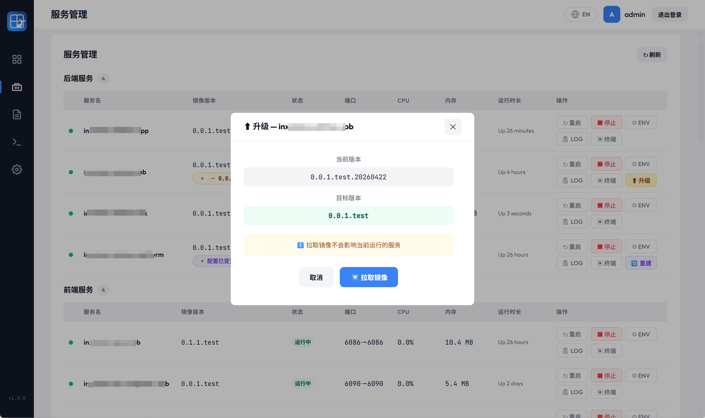

当 `image:` 服务的声明镜像与运行镜像不一致时，服务行会出现升级操作。

升级流程：

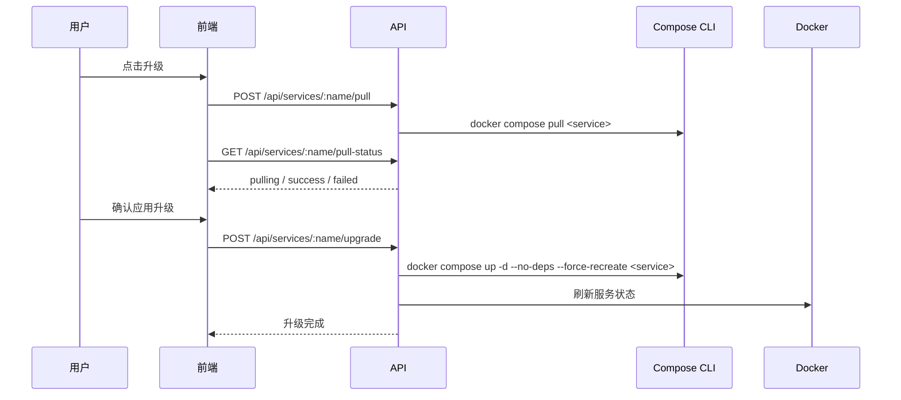

限制：

- 仅 `image:` 服务支持升级检测和拉取。
- `build:` 型服务不做镜像差异检测。
- 镜像仓库凭据由 Docker 自身管理，首次登录请使用 `docker login` 或部署脚本完成。

### 6.6 环境变量配置

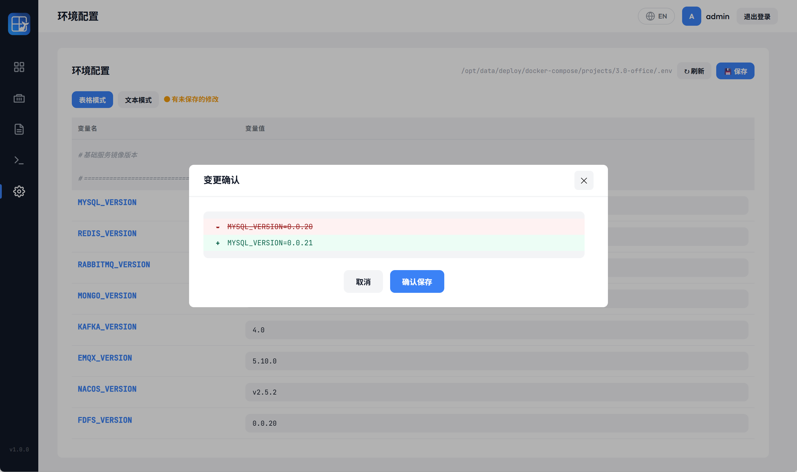

`.env` 编辑支持两种模式：

| 模式   | 说明                       |
| ---- | ------------------------ |
| 表格模式 | 按变量行编辑 key/value，保留注释和空行 |
| 文本模式 | 直接编辑原始 `.env` 文本         |

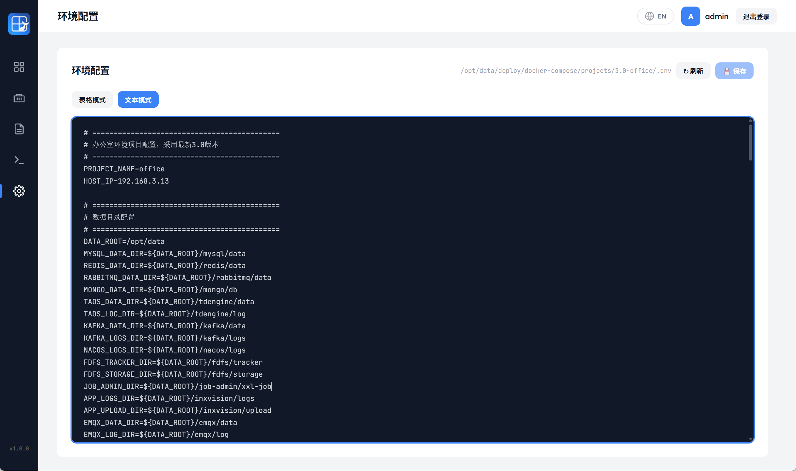

保存行为：

1. 保存前展示差异确认。
2. 自动生成备份文件，格式为 `.env.bak.YYYYMMDD-HHMMSS`。
3. 保存后重新解析 Compose 文件和 `.env`。
4. 对受 `.env` 变更影响的服务展示“配置已变更”提示。
5. 用户可在服务页点击“重建”让配置生效。

实例环境变量查看：

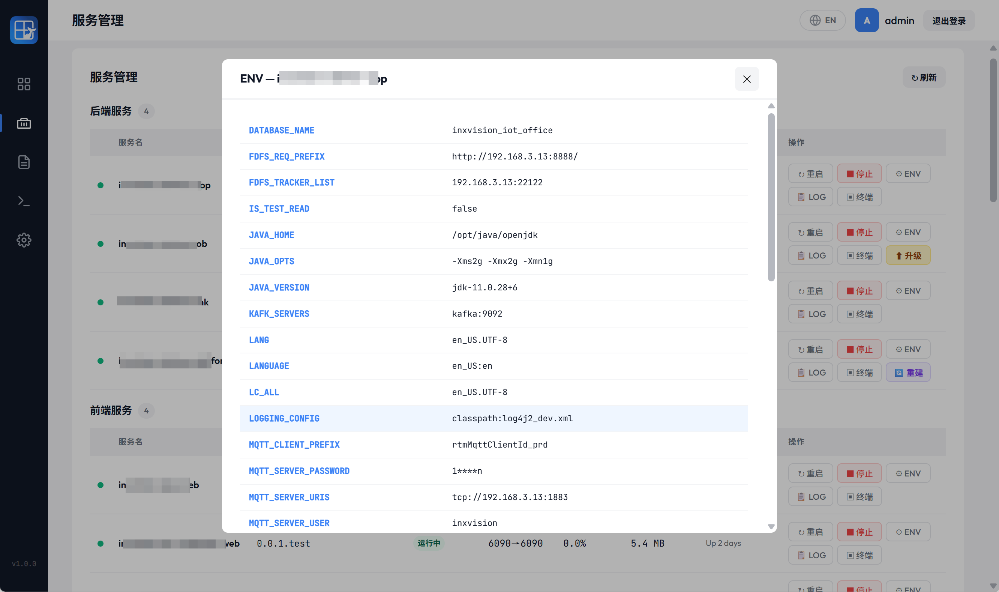

敏感变量会按变量名脱敏，包含 `PASSWORD`、`SECRET`、`TOKEN`、`PASS` 的 key 不展示完整值。

### 6.7 日志查看

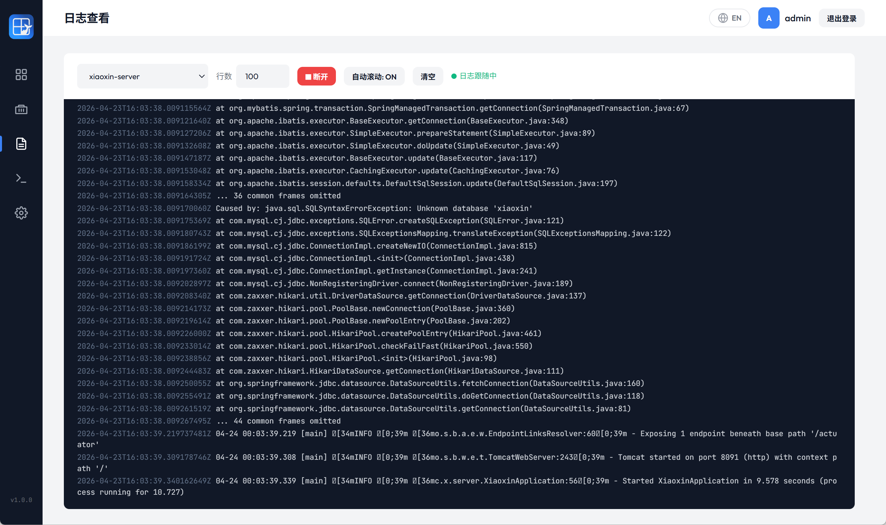

日志页支持：

| 功能   | 说明                                      |
| ---- | --------------------------------------- |
| 服务选择 | 展示已部署服务                                 |
| 历史日志 | 获取最近 N 行日志，默认 200 行                     |
| 实时日志 | 通过 SSE 持续推送 Docker logs                 |
| 自动滚动 | 可开关                                     |
| 重连跟随 | 服务重建、容器 ID 变化或短暂不可用时，前端展示状态，后端尝试重新挂载日志源 |
| 日志清理 | 清空当前前端显示内容，不影响容器日志                      |

英文界面：


### 6.8 Web 容器直连终端

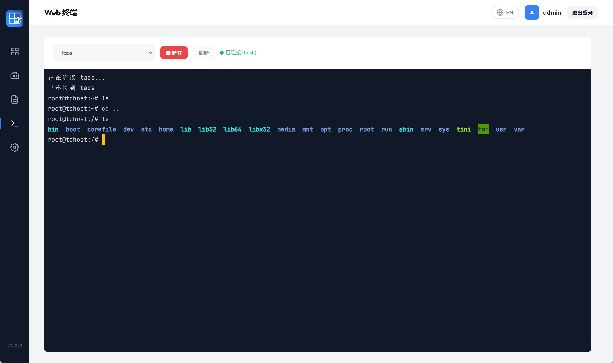

Web 终端基于 Docker Exec API，不需要 SSH 到宿主机。

| 功能       | 说明                                                                       |
| -------- | ------------------------------------------------------------------------ |
| 连接对象     | 仅运行中服务                                                                   |
| Shell 探测 | Linux 容器优先 `bash`，回退 `/bin/sh`；Windows 容器尝试 `cmd.exe` 和 `powershell.exe` |
| TTY      | 固定开启 TTY                                                                 |
| 尺寸同步     | 前端 resize 后同步到 Docker Exec                                               |
| 并发限制     | 默认全局最多 8 个活跃终端会话                                                         |
| 会话生命周期   | 一个 WebSocket 对应一个 Docker Exec 会话，断开后重新连接会创建新 shell                       |

安全注意：

- Web 终端等价于进入容器内部执行命令，应只暴露给可信用户。
- 当前版本不记录命令输入和终端输出审计日志。
- 建议在反向代理层启用 HTTPS。

### 6.9 关于信息

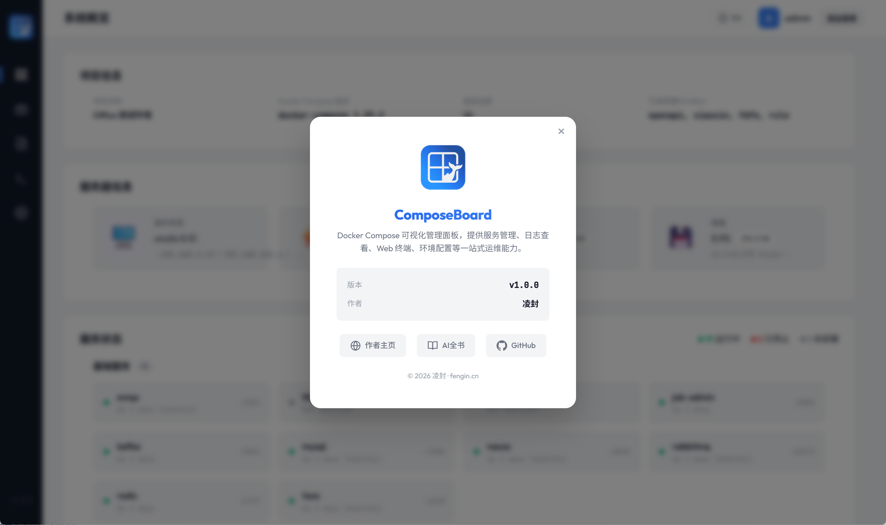

关于弹窗展示产品名称、版本、作者主页、AI 全书和 GitHub 地址，便于开源传播和问题反馈。

## 7. 操作规则汇总

| 服务状态           | 服务类型                | Profile 状态       | 可用操作                                        |
| -------------- | ------------------- | ---------------- | ------------------------------------------- |
| `running`      | `image:`            | 任意               | 停止、重启、查看 ENV、日志、终端；存在镜像差异时可升级；存在 env 变更时可重建 |
| `running`      | `build:`            | 任意               | 停止、重启、查看 ENV、日志、终端；不支持镜像升级                  |
| `exited`       | `image:` / `build:` | 任意               | 启动、查看 ENV、日志                                |
| `not_deployed` | `image:`            | 无 profile        | 启动                                          |
| `not_deployed` | `image:`            | profile disabled | 先启用 Profile                                 |
| `not_deployed` | `build:`            | 任意               | 不支持面板直接启动，需使用 Compose 命令或后续部署向导能力           |

## 8. 局限和注意事项

| 类别          | 当前边界                                        |
| ----------- | ------------------------------------------- |
| 项目范围        | 一个 ComposeBoard 实例管理一个 Compose 项目目录         |
| Docker 连接   | 仅本地 Docker daemon，不支持远程 Docker Host         |
| 副本模型        | 按一服务一容器视图处理，不管理 scale / replicas            |
| 权限模型        | 单账号密码，不支持多用户、角色和审计                          |
| `build:` 服务 | 已部署后可启停、重启、日志、终端；未部署构建启动不由当前面板处理            |
| 部署向导        | 开发期有规划，当前代码未实现对外页面和接口                       |
| 设置页         | 当前只有 Dashboard 使用的项目设置只读 API，无完整设置页面        |
| 凭据管理        | 不保存镜像仓库凭据，依赖 Docker daemon 的 `docker login` |

## 9. 推荐使用方式

1. 每个 Compose 项目部署一个 ComposeBoard 实例。
2. 给项目设置稳定的 `COMPOSE_PROJECT_NAME`，避免目录名变化影响标签匹配。
3. 给服务增加 `com.composeboard.category` 标签，改善服务分组。
4. 使用 Compose Profiles 描述可选服务组。
5. 修改 `.env` 后通过服务页的重建提示逐项确认。
6. 对公网访问启用 HTTPS 和额外访问控制。

## 10. 相关文档

- [产品技术说明](TECHNICAL_OVERVIEW.md)
- [产品技术参数说明](TECHNICAL_PARAMETERS.md)
- [产品编译、部署和使用手册](BUILD_DEPLOY_USAGE.md)
- [开发规范文档](DEVELOPMENT_STANDARDS.md)
- [产品精简介绍](INTRODUCTION.md)


## 作者信息

作者：凌封  
作者主页：[https://fengin.cn](https://fengin.cn)  
AI 全书：[https://aibook.ren](https://aibook.ren)  
GitHub：[https://github.com/fengin/compose-board](https://github.com/fengin/compose-board)
