# ComposeBoard 产品技术说明

> 面向后端开发、前端开发、架构维护者和需要理解实现边界的运维人员。本文以当前代码实现为准，开发期文档中未落地的设置页、部署向导、远程 Docker Host 等能力不作为当前发布功能描述。

## 1. 架构目标

ComposeBoard 从旧版项目重构为标准化开源项目时，核心架构目标是：

1. 分离 API、业务编排、Compose 解析、Docker Engine 访问和终端会话。
2. 以 Compose 声明态为主视图，不再只看当前已有容器。
3. 使用 Docker Compose 原生 label 定位容器，避免服务名猜测。
4. 保持单文件、低资源、离线优先的部署方式。
5. 对 `image:` 服务提供升级和重建能力，对 `build:` 服务保持边界清晰。

## 2. 总体架构

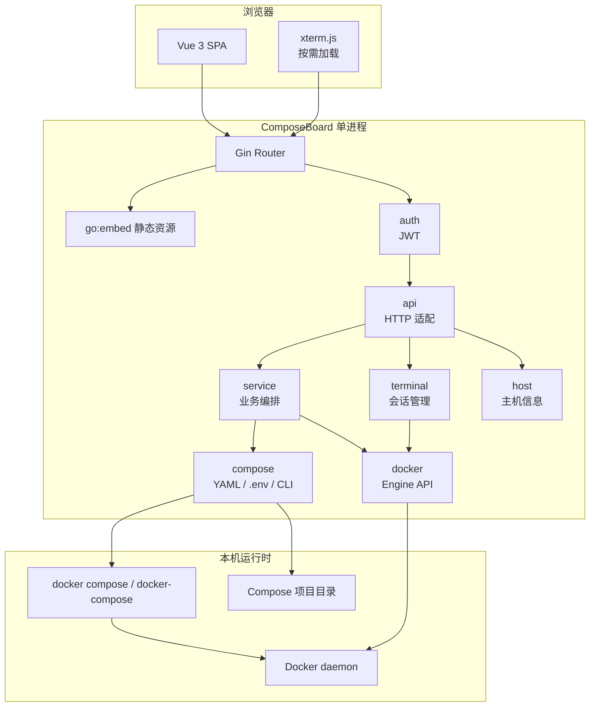

## 3. 代码结构

```text
compose-board/
├─ main.go                         # 入口、配置加载、组件组装、路由注册、静态资源服务
├─ config.yaml.template            # 配置模板
├─ Makefile                        # 部分构建任务和 i18n 校验入口
├─ internal/
│  ├─ api/                         # HTTP API 适配层
│  │  ├─ handler.go                # Handler 依赖聚合
│  │  ├─ services.go               # 服务列表、状态、启停、运行时 env
│  │  ├─ upgrade.go                # pull、pull-status、upgrade、rebuild
│  │  ├─ profiles.go               # Profiles 启用/停用
│  │  ├─ env.go                    # .env 读写
│  │  ├─ logs.go                   # 历史日志和 SSE 实时日志
│  │  ├─ terminal.go               # Web 终端 WebSocket 接入
│  │  ├─ settings.go               # 项目设置只读 API
│  │  └─ host.go                   # 主机信息 API
│  ├─ auth/                        # 登录与 JWT 中间件
│  ├─ compose/                     # Compose 文件发现、YAML 解析、.env 模型、CLI 执行
│  ├─ config/                      # config.yaml 加载与默认值
│  ├─ docker/                      # Docker Engine API、Transport、缓存、Exec
│  ├─ host/                        # 主机 OS、CPU、内存、磁盘、IP 和 Docker 版本
│  ├─ service/                     # 服务视图、生命周期、升级、Profiles、状态文件
│  └─ terminal/                    # Web 终端会话生命周期
├─ web/
│  ├─ index.html                   # Vue SPA 入口
│  ├─ css/                         # 样式和本地字体/xterm 样式
│  ├─ img/                         # 图标
│  └─ js/
│     ├─ app.js                    # 路由和根应用
│     ├─ api.js                    # API 客户端
│     ├─ i18n.js                   # 轻量 i18n
│     ├─ locales/                  # zh/en 文案
│     ├─ pages/                    # dashboard/services/logs/terminal/env/login
│     ├─ components/               # 通用组件
│     └─ vendor/                   # Vue、Vue Router、xterm.js
└─ docs/
   ├─ ui/                          # 对外截图
   ├─ logo/                        # 产品 Logo
   └─ dev/                         # 开发过程归档材料
```

## 4. 分层职责

| 层           | 主要职责                                          | 不做什么                        |
| ----------- | --------------------------------------------- | --------------------------- |
| `main.go`   | 组件初始化、依赖注入、路由注册、静态资源服务                        | 业务规则                        |
| `api/`      | 参数读取、HTTP 状态码、JSON 响应、SSE/WS 接入               | 直接解析 Compose、直接写复杂状态        |
| `service/`  | 服务视图聚合、生命周期规则、升级编排、Profile 状态、状态文件            | HTTP 细节、底层 Docker Transport |
| `compose/`  | Compose 文件发现和解析、`.env` 行级模型、CLI 命令执行          | Docker Engine API           |
| `docker/`   | Docker Engine HTTP API、容器缓存、Exec、平台 Transport | Compose YAML 解析             |
| `terminal/` | WebSocket 到 Docker Exec 的双向转发、会话限制、心跳、关闭收敛    | 服务状态机                       |
| `host/`     | 主机资源和 IP 候选检测                                 | Compose / Docker 操作         |
| `web/`      | 页面交互、i18n、状态轮询、终端和日志展示                        | 业务最终裁决                      |

## 5. 启动流程

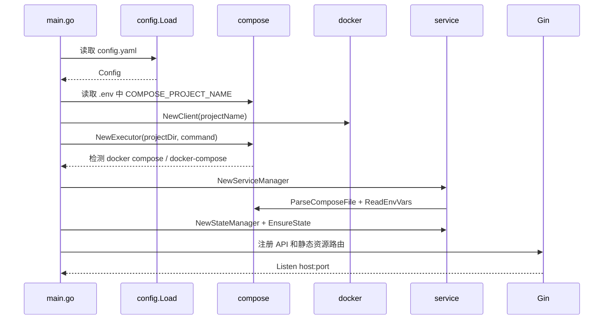

项目名匹配规则：

1. 优先读取项目 `.env` 中的 `COMPOSE_PROJECT_NAME`。
2. 如果不存在，则使用项目目录名，并按 docker-compose v1 习惯移除部分特殊字符。
3. `config.yaml` 的 `project.name` 只用于 UI 展示，不用于 Docker label 匹配。

## 6. Compose 声明态解析

`internal/compose/parser.go` 负责自动发现 Compose 文件，优先级如下：

1. `compose.yaml`
2. `compose.yml`
3. `docker-compose.yml`
4. `docker-compose.yaml`

解析后的核心结构：

```go
type ComposeProject struct {
    Version  string
    Services map[string]*DeclaredService
    FilePath string
}

type DeclaredService struct {
    Name        string
    Image       string
    Build       string
    Profiles    []string
    DependsOn   []string
    Ports       []string
    Environment []string
    Labels      map[string]string
    Category    string
    ImageSource string
    VarRefs     []string
}
```

分类来自 label `com.composeboard.category`，缺省为 `other`。服务来源类型：

| `ImageSource` | 条件                      | 当前能力                          |
| ------------- | ----------------------- | ----------------------------- |
| `registry`    | 存在 `image:`             | 支持镜像差异检测、pull、upgrade、rebuild |
| `build`       | 无 `image:` 且存在 `build:` | 已部署后支持启停、日志、终端；未部署不由面板直接构建启动  |
| `unknown`     | 无 `image:` 且无 `build:`  | 只读展示为主                        |

## 7. 服务视图模型

`internal/service/manager.go` 将声明态与运行态聚合为 `ServiceView`：

```go
type ServiceView struct {
    Name        string
    Category    string
    ImageRef    string
    ImageSource string
    Profiles    []string
    DependsOn   []string
    HasBuild    bool

    ContainerID string
    Status      string
    State       string
    StartedAt   string
    Ports       []docker.PortMapping
    Health      string
    StartupWarning bool
    CPU         float64
    MemUsage    uint64
    MemLimit    uint64
    MemPercent  float64

    DeclaredImage string
    RunningImage  string
    ImageDiff     bool
    EnvDiff       bool
    PendingEnv    []string
}
```

聚合方式：

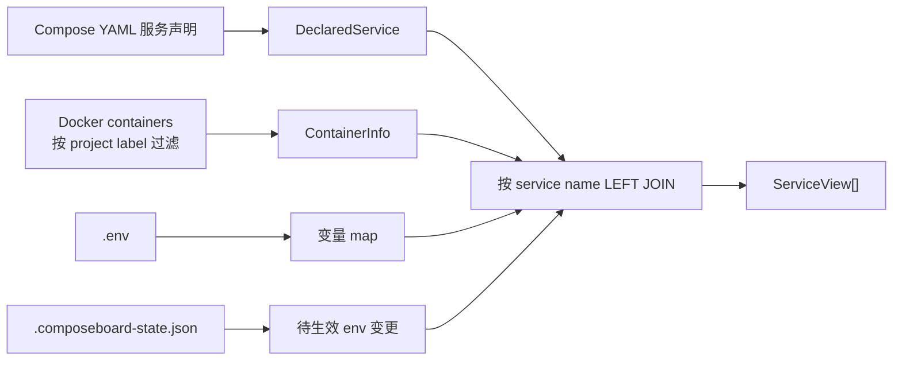

关键点：

- `GET /api/services` 返回所有声明服务，不只返回已有容器。
- 运行态通过 `com.docker.compose.service` 与声明态匹配。
- 对运行中容器采集 CPU、内存、健康状态和端口。
- 对 `created`、长时间 `restarting`、`unhealthy` 派生 `startup_warning`。
- `image_diff` 只对 `registry` 服务计算。

## 8. Docker Engine 通信

ComposeBoard 不依赖 Docker SDK，而是直接通过 HTTP 调用 Docker Engine API。

| 平台          | 连接方式                                | 代码                     |
| ----------- | ----------------------------------- | ---------------------- |
| Linux/macOS | Unix Socket `/var/run/docker.sock`  | `transport_unix.go`    |
| Windows     | Named Pipe `\\.\pipe\docker_engine` | `transport_windows.go` |

容器过滤：

```text
/containers/json?all=true&filters={"label":["com.docker.compose.project=<project>"]}
```

单服务实时状态过滤：

```text
filters={"label":["com.docker.compose.project=<project>","com.docker.compose.service=<service>"]}
```

如果同一服务短时间出现多个候选容器，选择策略是：

1. 优先 running 容器。
2. 否则选择创建时间最新的容器。

## 9. 容器缓存策略

`internal/docker/cache.go` 负责降低 Docker API 压力。

| 参数         | 当前值      | 说明                 |
| ---------- | -------- | ------------------ |
| 后台刷新间隔     | 15 秒     | 有前端访问时刷新           |
| 空闲暂停时间     | 60 秒     | 超过 60 秒无访问则暂停并清空缓存 |
| 首次快速刷新     | 不含 stats | 先快速返回容器列表          |
| 延迟资源刷新     | 3 秒后     | 再采集 CPU/内存         |
| stats 并发   | 5        | 并发采集运行中容器资源        |
| refresh 超时 | 20 秒     | 防止 Docker 调用长期阻塞   |

操作后的单服务状态轮询不只依赖缓存，而是通过 `GET /api/services/:name/status` 直查 Docker，并同步回写缓存。

## 10. 生命周期与状态机规则

服务操作与 Profile 启停采用“批量列表做基线、单服务实时接口做操作真相源”的模型。这个设计用于避免列表缓存、自动刷新、Profile 聚合状态和行内 loading 互相覆盖。

### 10.1 真相源划分

| 数据          | 接口                               | 用途                         |
| ----------- | -------------------------------- | -------------------------- |
| 服务列表基线      | `GET /api/services`              | 页面初始渲染、15 秒自动刷新、CPU/内存全量补齐 |
| 单服务实时状态     | `GET /api/services/:name/status` | 所有单服务操作的 loading 判定、实时行内更新 |
| Profile 配置态 | `GET /api/profiles`              | Profile 头部状态、启用/停用按钮展示     |

`GET /api/services/:name/status` 不走列表缓存，而是按 service name 直查 Docker。查到实时状态后会同步回写 `ContainerCache`；如果当前服务不存在容器，则从缓存移除该服务，列表层自然显示为 `not_deployed`。

### 10.2 基础生命周期规则

`internal/service/lifecycle.go` 封装启停重启规则：

| 操作                  | 实现                                                 |
| ------------------- | -------------------------------------------------- |
| 启动已停止容器             | Docker Engine `POST /containers/{id}/start`        |
| 启动未部署 `image:` 固定服务 | `docker compose up -d <service>`                   |
| 启动未部署 profile 服务    | 若 profile 未启用，返回 `services.start.profile_required` |
| 启动未部署 `build:` 服务   | 返回 `services.start.build_not_supported`            |
| 停止容器                | Docker Engine `POST /containers/{id}/stop?t=10`    |
| 重启容器                | Docker Engine `POST /containers/{id}/restart?t=10` |

### 10.3 单服务操作状态机

适用操作：

- `start`
- `stop`
- `restart`
- `upgrade`
- `rebuild`

前端操作流程：

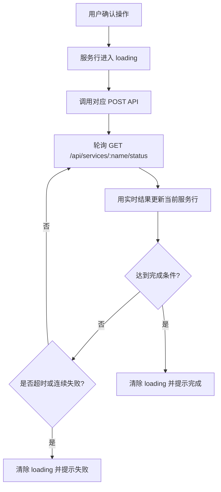

轮询节奏：

| 项            | 当前实现            |
| ------------ | --------------- |
| 首次单服务状态检查    | 操作 API 成功后约 1 秒 |
| 后续轮询间隔       | 3 秒             |
| 普通操作超时       | 2 分钟            |
| `upgrade` 超时 | 5 分钟            |

完成判据：

| 操作        | 完成条件                                                           |
| --------- | -------------------------------------------------------------- |
| `stop`    | `status === "exited"` 或 `status === "not_deployed"`            |
| `start`   | `status === "running"`                                         |
| `restart` | `status === "running"`，且 `started_at` 或 `container_id` 相比操作前变化 |
| `upgrade` | 满足 `restart` 判据，且 `image_diff === false`                       |
| `rebuild` | 满足 `restart` 判据，且 `pending_env` 为空                             |

`started_at` 是重启、升级、重建的主判据，`container_id` 是容器替换场景下的补充锚点，避免只看到 `running` 就误判操作完成。

失败收敛：

| 场景                                | 判定                                                                               |
| --------------------------------- | -------------------------------------------------------------------------------- |
| `start`                           | 连续 3 次拿到 `exited` 或 `restarting`，且没有出现新的 `started_at` 或 `container_id`，判定启动失败    |
| `restart` / `upgrade` / `rebuild` | 已出现新的 `started_at` 或 `container_id` 后，连续 3 次仍为 `exited` 或 `restarting`，判定新实例启动失败 |
| 网络抖动或短暂查不到容器                      | 不立即失败，继续轮询，由超时兜底                                                                 |

### 10.4 服务按钮矩阵

`loading` 优先级最高。只要某一行处于操作中，就显示 loading，不显示普通操作按钮；loading 结束后再按服务状态渲染。

| 当前状态           | 显示按钮                                                                                                        |
| -------------- | ----------------------------------------------------------------------------------------------------------- |
| `running`      | `重启`、`停止`、`查看环境变量`、`查看日志`、`终端`；若 `image_diff=true` 追加 `升级`；若 `pending_env.length>0 && !image_diff` 追加 `重建`  |
| `exited`       | `启动`、`查看环境变量`、`查看日志`；若 `image_diff=true` 追加 `升级`；若 `pending_env.length>0 && !image_diff` 追加 `重建`            |
| `created`      | `启动`、`重启`、`查看环境变量`、`查看日志`；若 `image_diff=true` 追加 `升级`；若 `pending_env.length>0 && !image_diff` 追加 `重建`       |
| `restarting`   | `重启`、`停止`、`查看环境变量`、`查看日志`；若 `image_diff=true` 追加 `升级`；若 `pending_env.length>0 && !image_diff` 追加 `重建`       |
| `not_deployed` | 固定 `image:` 服务显示 `启动`；已启用 Profile 下的 `image:` 可选服务显示 `启动`；未启用 Profile 下的可选服务不显示单服务启动按钮；`build:` 服务不显示面板启动按钮 |

设计说明：

- `created` / `restarting` 视为“已部署但异常”的运行态，需要继续暴露恢复和排查入口。
- `created` 不显示 `停止`，因为该状态下 Docker `stop` 通常不会把它转换成有意义的 `exited` 状态。
- `查看日志` 对所有 `status != "not_deployed"` 的服务可见，便于排查异常。
- Web 终端只对 `running` 服务可见，与后端终端入口校验一致。
- `startup_warning` 只影响状态列告警展示，不参与按钮隐藏和 loading 完成判定。

### 10.5 `startup_warning` 运行态告警

`startup_warning` 是当前运行态派生诊断字段，不是某次操作失败的历史记忆。

| 条件                               | 判定                        |
| -------------------------------- | ------------------------- |
| `running` 且 `health=unhealthy`   | `startup_warning = true`  |
| `created` 持续超过 30 秒              | `startup_warning = true`  |
| `restarting` 状态文本解析出的持续时间超过 30 秒 | `startup_warning = true`  |
| 其他状态                             | `startup_warning = false` |

该字段同时由 `GET /api/services` 和 `GET /api/services/:name/status` 返回。前端只展示通用“启动异常”提示，具体原因仍通过日志、运行时环境变量和 Web 终端排查。

### 10.6 Profile 启用与停用状态机

Profile 只表示“配置是否启用”，不表示组内所有服务是否运行。Profile 状态持久化在 `.composeboard-state.json > profiles` 中，只保留：

| 状态         | 含义              |
| ---------- | --------------- |
| `enabled`  | Profile 当前配置为启用 |
| `disabled` | Profile 当前配置为停用 |

不再引入 `partial` 或“补齐启用”这类运行态聚合中间态。

启用流程：

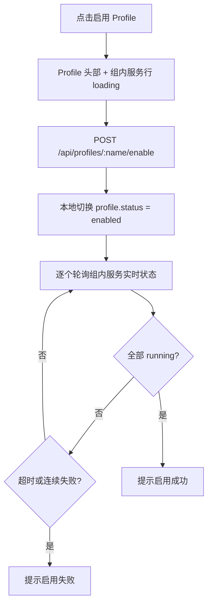

停用流程：

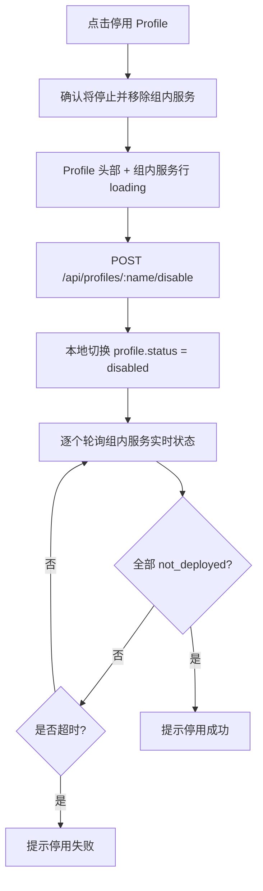

Profile 操作参数：

| 项            | 当前实现                                    |
| ------------ | --------------------------------------- |
| 启用后端动作       | `docker compose --profile <name> up -d` |
| 停用后端动作       | 对 profile 下服务执行 `stop + rm`             |
| 前端首次检查       | API 成功后约 300 ms                         |
| 后续轮询间隔       | 3 秒                                     |
| Profile 操作超时 | 3 分钟                                    |
| 启用完成条件       | 组内服务全部 `running`                        |
| 停用完成条件       | 组内服务全部 `not_deployed`                   |

### 10.7 自动刷新与操作轮询边界

- `15s` 自动刷新保留，只做页面基线刷新。
- 正在操作的服务，其 loading 完成与否完全不依赖自动刷新。
- 自动刷新拿到的数据若比实时轮询旧，不应覆盖正在操作服务的完成判定。
- 单服务实时接口每次都会回写缓存，所以自动刷新最终会和实时轮询收敛到同一状态。
- `startup_warning` 由列表基线与实时接口统一派生，因此既能覆盖操作中的异常态，也能在重新打开页面时继续反映当前异常服务。

## 11. 升级与重建

`internal/service/upgrade.go` 负责编排 `pull`、`upgrade` 和 `rebuild`。

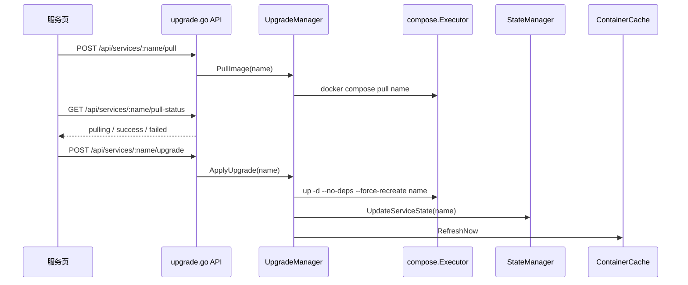

重建用于应用 `.env` 变更，执行方式同样是 `up -d --no-deps --force-recreate <service>`，并更新状态文件基线。

## 12. 状态文件

状态文件位于 Compose 项目目录：

```text
.composeboard-state.json
```

结构：

```json
{
  "version": 1,
  "services": {
    "api": {
      "image": "example/api:1.0.0",
      "env": {
        "APP_PORT": "8080"
      },
      "updated_at": "2026-04-24T12:00:00Z"
    }
  },
  "profiles": {
    "worker": {
      "enabled": true,
      "updated_at": "2026-04-24T12:00:00Z"
    }
  }
}
```

设计规则：

- 首次启动没有状态文件时，以当前 Compose 和 `.env` 作为基线，避免误报全部服务待重建。
- 不读取、不迁移旧版 `.deployboard-state.json`。
- Profile 状态表示“配置启用态”，不等同于所有服务都在 running。
- `.env` 变量变更只对服务配置中引用的变量触发 `pending_env`，image 字段中的变量变化走镜像差异逻辑。

## 13. `.env` 行级模型

`internal/compose/env.go` 将 `.env` 解析为行级结构：

```go
type EnvEntry struct {
    Type  string `json:"type"`  // variable | comment | blank
    Key   string `json:"key,omitempty"`
    Value string `json:"value,omitempty"`
    Raw   string `json:"raw"`
    Line  int    `json:"line"`
}
```

保存接口支持两种模式：

| 模式   | 请求体                    | 用途   |
| ---- | ---------------------- | ---- |
| 原始文本 | `{ "content": "..." }` | 文本模式 |
| 行级条目 | `{ "entries": [...] }` | 表格模式 |

保存前会自动备份旧文件，备份名为：

```text
.env.bak.YYYYMMDD-HHMMSS
```

### 13.1 变量展开作用域

`ExpandVars(template, vars)` 用于将 Compose 文件中的 `${VAR}` 引用展开为实际值。它支持 Compose 完整变量语法（`${VAR}`、`$VAR`、`${VAR:-default}`、`${VAR-default}`、`${VAR:+rep}`、`${VAR+rep}`、`${VAR:?err}`、`${VAR?err}`）。

变量来源有严格约束——**只读取项目目录下的 `.env` 文件**，不合并以下来源：

| 不读取的来源 | 原因 |
| --- | --- |
| ComposeBoard 进程的 shell 环境变量 (`os.Environ()`) | 避免运行环境污染镜像差异检测结果 |
| `services.<name>.environment:` 字段的默认值 | 那是容器内环境变量，不是 Compose 变量 |
| `env_file:` 字段、`--env-file` 参数 | v1 单文件约束 |

这与 Compose CLI 默认行为略有差异（CLI 会读 shell env），但保证了"同一 Compose 文件 + 同一 `.env` → 同一镜像解析结果"的可复现性。如果镜像版本需要依赖某个变量，必须写进 `.env`。

职责边界：变量**引用名提取**在 `compose/parser.go`（`DeclaredService.VarRefs`），变量**值展开**在 `compose/env.go`（`ExpandVars`）。两个文件不重复扫描 `${...}`。

## 14. 日志流

日志接口：

| 方法  | 路径                                              | 说明       |
| --- | ----------------------------------------------- | -------- |
| GET | `/api/services/:name/logs?tail=200`             | 历史日志     |
| GET | `/api/services/:name/logs?follow=true&tail=200` | SSE 实时日志 |

实时日志策略：

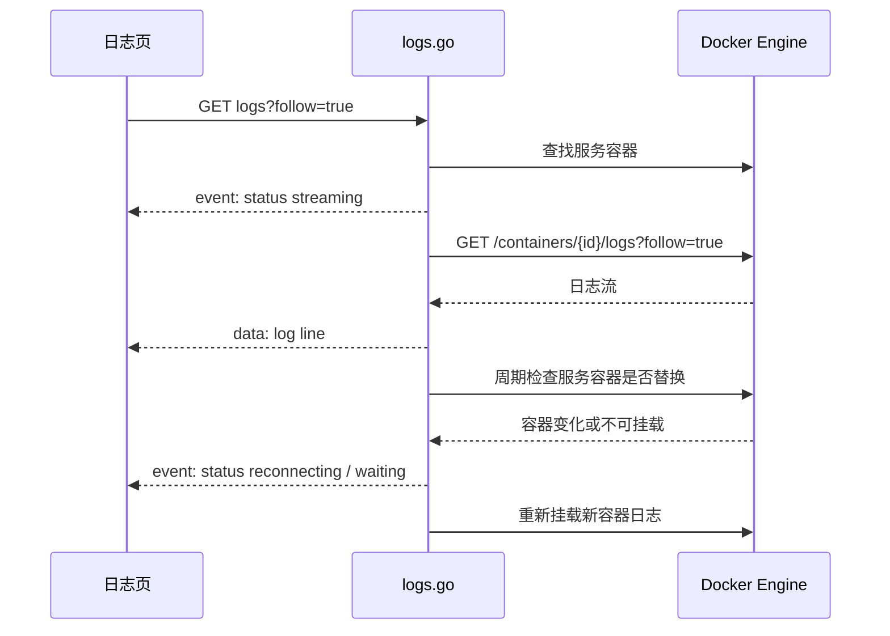

技术参数：

- 日志源检查间隔：800 ms。
- 重试延迟：1200 ms。
- 单行日志扫描上限：1 MiB。
- Docker logs 固定开启 timestamps，前端可做时间展示和续挂判断。

## 15. Web 终端

Web 终端采用 **Docker Exec API + xterm.js**，不依赖 SSH 服务。该能力作为独立模块实现，主体代码集中在 `api/terminal.go`、`terminal/session.go`、`docker/exec.go`、`web/js/pages/terminal.js`。

### 15.1 架构与协议

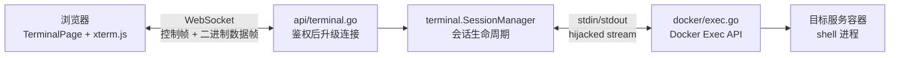

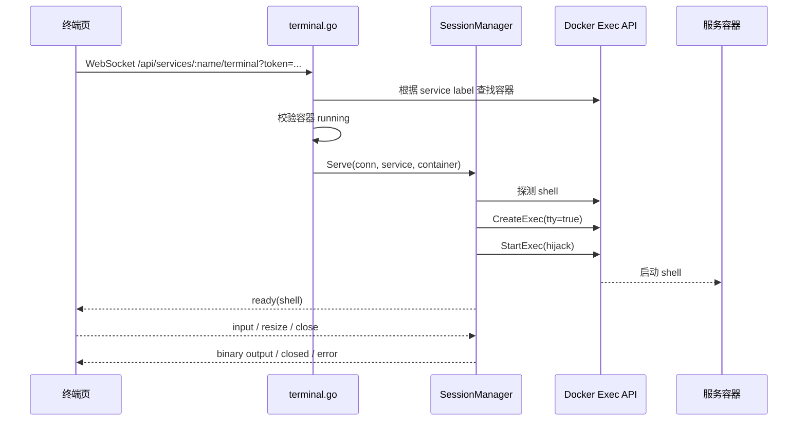

**API**：`GET (WS) /api/services/:name/terminal`
（`:name` 必须是 Compose 项目中的 service name，后端通过 label 定位容器，不接受任意 container id）

**WebSocket 协议机制**：
- 前端发送文本控制帧（如 `{ "type": "input", "data": "pwd\n" }`、`resize`、`close`）。
- 后端发送文本控制帧（如 `ready`、`error`、`closed`）。
- 后端从 Docker hijacked connection 读到的 TTY 原始字节流，通过 WebSocket **二进制帧**直接推给前端 xterm.js。TTY 模式下 stdout/stderr 是原始流，不需要 `stdcopy.StdCopy` 拆分。

### 15.2 会话生命周期与限制

一个 WebSocket 连接对应一个 Docker Exec 会话。断开（或用户主动关闭、路由离开、容器停止）时，会话立即结束并释放资源，**不保留后台会话、不自动恢复旧会话**。重新连接会创建新的 shell。

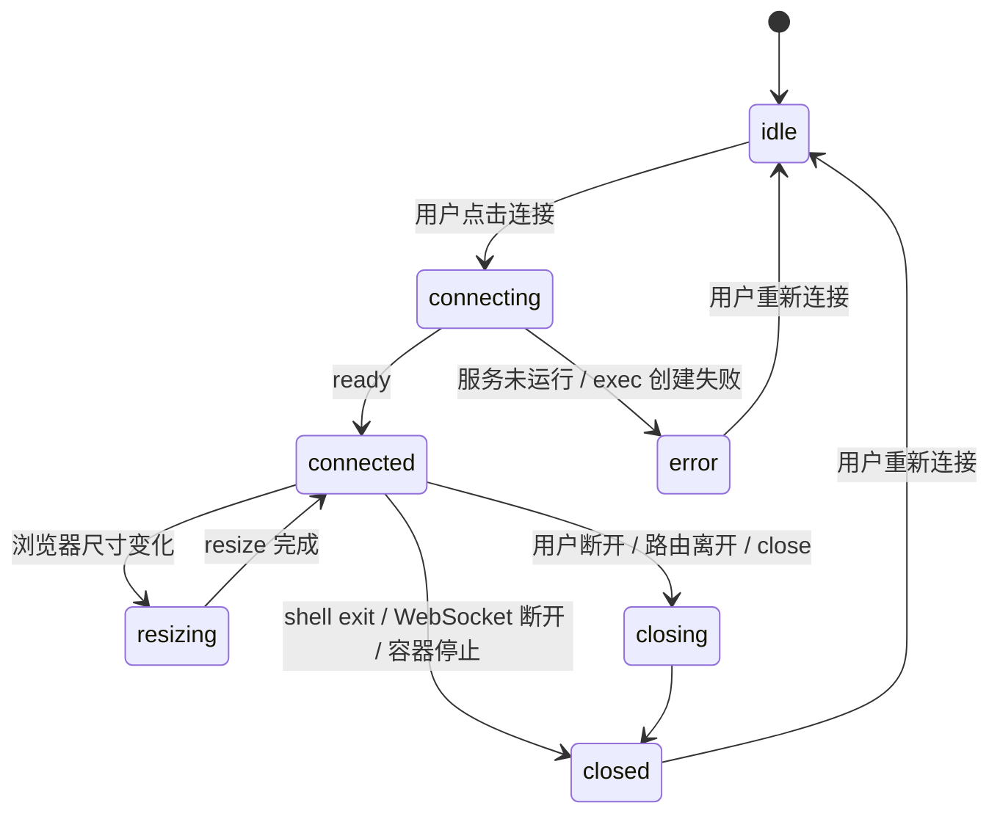

### 15.3 核心参数与平台适配

会话参数控制：

| 参数                   | 当前值       |
| -------------------- | --------- |
| 最大活跃终端会话             | 8         |
| WebSocket pong 超时    | 60 秒      |
| ping 间隔              | 25 秒      |
| 单次写超时                | 10 秒      |
| Exec create/start 超时 | 10 秒      |
| shell 探测超时           | 5 秒       |
| 控制消息最大大小             | 64 KiB    |
| 输出读取缓冲区              | 32 KiB    |
| 终端列范围                | 10 到 1000 |
| 终端行范围                | 3 到 500   |

**TTY 模式**：
为支持 `vi`、`top` 等交互程序，固定使用 TTY 模式创建 exec。`resize` 到达时后端调用 Docker Resize API 同步尺寸。

**Shell 选择**：
Shell 按目标容器 OS 探测，与宿主机平台无关，探测结果按 `containerID` 缓存：

| 容器平台    | 尝试顺序                          |
| ------- | ----------------------------- |
| Linux   | `bash` -> `/bin/sh`           |
| Windows | `cmd.exe` -> `powershell.exe` |

**轻量化约束**：
前端 xterm.js、FitAddon 等依赖资源只在终端页面按需加载，不进入全局首屏资源包。后端限制最大活跃会话数，避免误操作占用过多 Docker daemon 资源。

## 16. API 清单

| 方法   | 路径                                | 说明             |
| ---- | --------------------------------- | -------------- |
| POST | `/api/auth/login`                 | 登录             |
| GET  | `/api/host/info`                  | 主机和 Docker 信息  |
| GET  | `/api/services`                   | 服务列表           |
| GET  | `/api/services/:name/status`      | 单服务实时状态        |
| POST | `/api/services/:name/start`       | 启动服务           |
| POST | `/api/services/:name/stop`        | 停止服务           |
| POST | `/api/services/:name/restart`     | 重启服务           |
| GET  | `/api/services/:name/env`         | 运行时环境变量        |
| POST | `/api/services/:name/pull`        | 拉取服务镜像         |
| GET  | `/api/services/:name/pull-status` | 查询镜像拉取状态       |
| POST | `/api/services/:name/upgrade`     | 应用升级           |
| POST | `/api/services/:name/rebuild`     | 重建服务           |
| GET  | `/api/profiles`                   | Profile 列表     |
| POST | `/api/profiles/:name/enable`      | 启用 Profile     |
| POST | `/api/profiles/:name/disable`     | 停用 Profile     |
| GET  | `/api/env`                        | 读取 `.env`      |
| PUT  | `/api/env`                        | 保存 `.env`      |
| GET  | `/api/services/:name/logs`        | 历史日志或 SSE 实时日志 |
| GET  | `/api/services/:name/terminal`    | WebSocket 终端   |
| GET  | `/api/settings/project`           | 项目信息只读 API     |

## 17. 前端实现

前端是无构建步骤的 Vue 3 SPA，脚本直接以本地 vendor 文件加载：

- `vue.global.prod.js`
- `vue-router.global.prod.js`
- `xterm.js`
- `xterm-addon-fit.js`

路由：

| 路径            | 页面               |
| ------------- | ---------------- |
| `/`           | 系统概览             |
| `/services`   | 服务管理             |
| `/logs`       | 日志查看             |
| `/terminal`   | Web 终端           |
| `/env`        | 环境配置             |
| `/containers` | 重定向到 `/services` |

状态同步策略：

- 服务列表页批量读取 `/api/services` 和 `/api/profiles`。
- 启停重启等同步操作后，按单服务轮询 `/api/services/:name/status`。
- pull 为异步状态，通过 `/pull-status` 轮询。
- 日志使用 SSE。
- 终端使用 WebSocket。

## 18. 安全模型

| 项            | 当前实现                                    |
| ------------ | --------------------------------------- |
| 登录           | 配置文件账号密码                                |
| API 鉴权       | JWT Bearer token                        |
| WebSocket 鉴权 | query token                             |
| JWT 算法       | HMAC 签名算法检查                             |
| Token 时长     | 24 小时                                   |
| Origin 检查    | 终端 WebSocket 检查 Origin host 与请求 host 一致 |
| 敏感变量         | 运行时 env 按 key 脱敏                        |
| 审计日志         | 当前不记录用户命令输入或终端输出                        |

部署建议：

- 生产环境必须修改默认密码。
- 建议配置固定且高强度的 `jwt_secret`。
- 公网访问应放在 HTTPS 反向代理后。
- Web 终端只应开放给可信用户。

## 19. 当前未实现但预留的方向

以下能力在开发过程文档中出现过，但当前代码没有对外实现完整功能：

| 能力                  | 当前状态                                           |
| ------------------- | ---------------------------------------------- |
| 部署向导                | 无 API 和页面                                      |
| 完整设置页               | 仅有 `/api/settings/project` 只读接口，供 Dashboard 使用 |
| 远程 Docker Host      | 未实现，仅本地 Docker daemon                          |
| 多项目管理               | 未实现，一个实例一个项目                                   |
| 生命周期钩子执行            | 配置结构存在，但当前无部署向导编排执行                            |
| HOST_IP 自动写入 `.env` | 配置结构存在，当前未在主流程执行                               |

对外文档和 README 应按上表描述为边界或后续方向，避免误导使用者。

## 20. 维护关注点

1. 新 API 应优先落在 `service/` 完成业务裁决，`api/` 只做 HTTP 适配。
2. 新前端文案必须同时维护 `zh.json` 和 `en.json`。
3. 不要恢复基于服务名的分类猜测，分类应继续使用 label。
4. 任何 Docker 操作都要明确超时。
5. 对操作后状态展示，优先单服务实时查询，不依赖全量缓存刷新。
6. 对 `build:` 服务保持边界明确，避免把本地构建、部署向导和升级逻辑混在普通服务操作里。

## 作者信息

作者：凌封  
作者主页：[https://fengin.cn](https://fengin.cn)  
AI 全书：[https://aibook.ren](https://aibook.ren) 
GitHub：[https://github.com/fengin/compose-board](https://github.com/fengin/compose-board)
